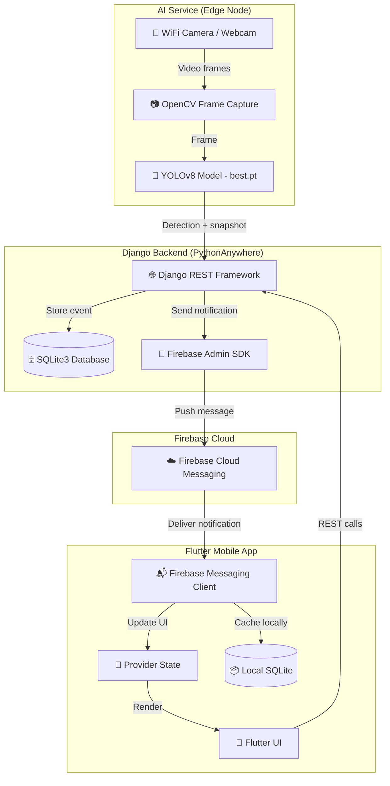
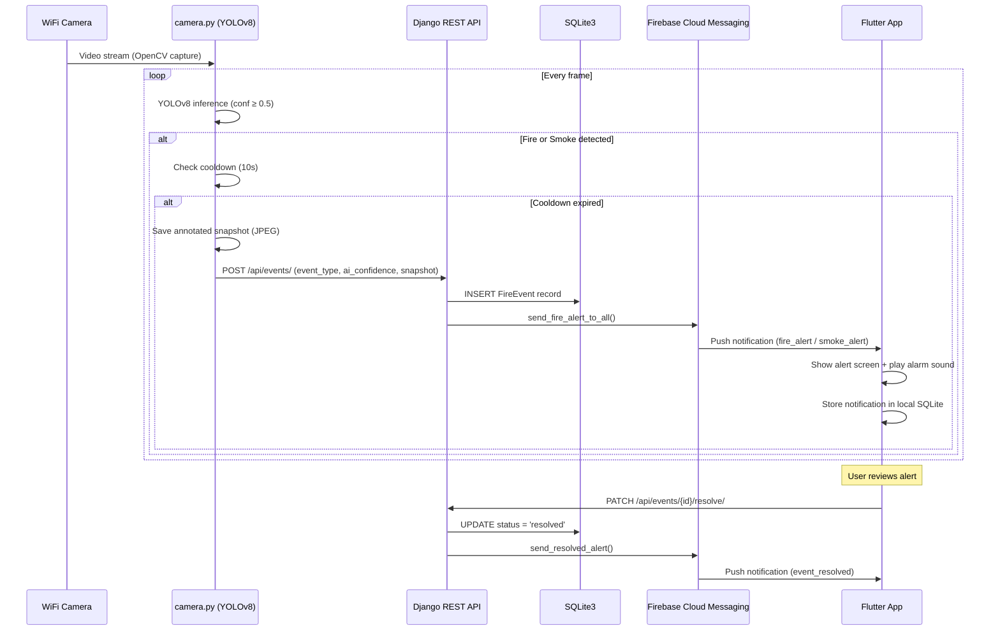
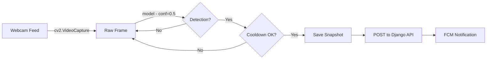
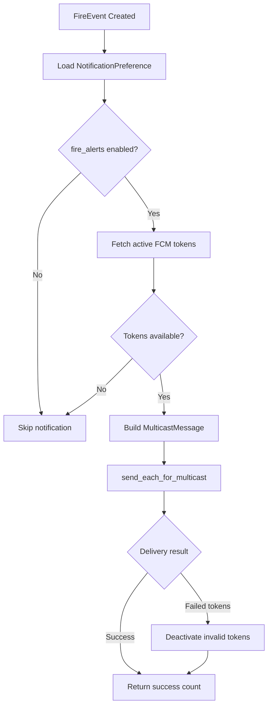
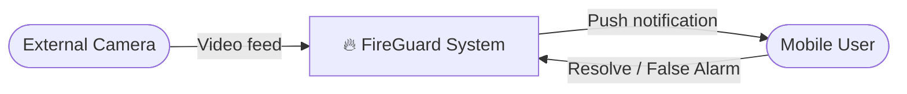
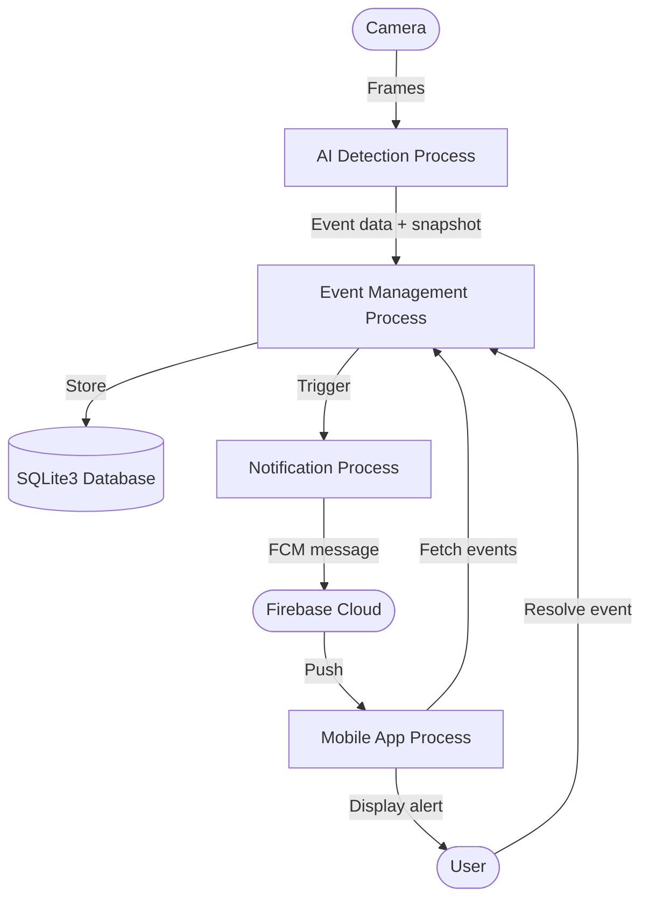
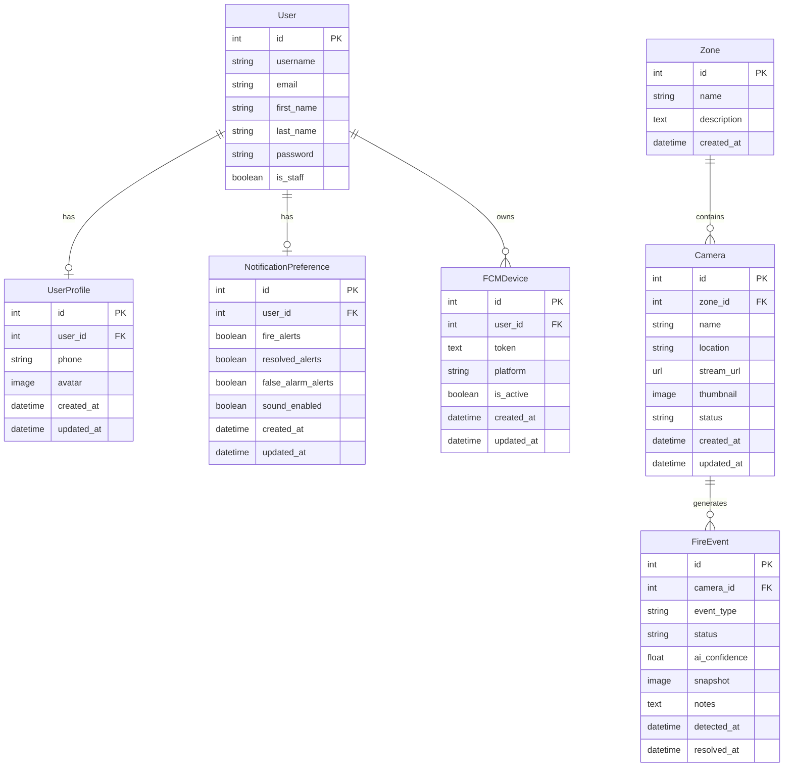

<div align="center">

# 🔥 FireGuard

### AI-Powered Fire & Smoke Detection and Emergency Alert System


**A graduation project that combines real-time computer vision with mobile push notifications to detect fire and smoke from live camera feeds and instantly alert registered users.**

---

[System Overview](#system-overview) · [Architecture](#system-architecture) · [AI Pipeline](#ai-detection-pipeline) · [Installation](#installation) · [Running](#running-the-system) · [Contributors](#contributors)

</div>

---

## Table of Contents

- [Problem Statement](#problem-statement)
- [Proposed Solution](#proposed-solution)
- [Features](#features)
- [Technology Stack](#technology-stack)
- [System Architecture](#system-architecture)
- [System Workflow](#system-workflow)
- [AI Detection Pipeline](#ai-detection-pipeline)
- [Firebase Notification Workflow](#firebase-notification-workflow)
- [Repository Structure](#repository-structure)
- [Installation](#installation)
- [Running the System](#running-the-system)
- [Screenshots](#screenshots)
- [Diagrams](#diagrams)
- [Contributors](#contributors)
- [Future Improvements](#future-improvements)
- [License](#license)

---

## Problem Statement

Traditional fire detection relies on physical sensors (smoke detectors, heat sensors) that suffer from limited coverage, delayed response in open or outdoor areas, and high false-alarm rates. In many buildings, warehouses, and industrial facilities, fires can spread rapidly before conventional systems trigger an alert — especially in areas with poor sensor coverage.

There is a need for an intelligent, vision-based detection system that can **identify fire and smoke in real time** from existing camera infrastructure and **immediately notify responsible personnel** through their mobile devices.

---

## Proposed Solution

**FireGuard** is a complete end-to-end system that addresses this gap by combining:

1. **AI-powered detection** — A YOLOv8 deep learning model processes live webcam frames to detect fire and smoke with configurable confidence thresholds.
2. **Backend event management** — A Django REST API receives detection events, stores them in an SQLite3 database, and triggers push notifications.
3. **Instant mobile alerts** — A Flutter mobile application receives Firebase Cloud Messaging (FCM) notifications with full event details, enabling immediate response.

The system is designed as a **graduation project prototype** that demonstrates the feasibility and architecture of a vision-based fire detection and alerting pipeline.

---

## Features

| Category | Feature | Description |
|----------|---------|-------------|
| 🤖 **AI** | Real-time fire & smoke detection | YOLOv8 model (`best.pt`) processes webcam frames in real time |
| 🤖 **AI** | Confidence-based filtering | Only detections above 50% confidence are reported |
| 🤖 **AI** | Cooldown mechanism | 10-second cooldown prevents duplicate alerts |
| 🤖 **AI** | Snapshot generation | Annotated detection frames saved as JPEG images |
| 🖥️ **Backend** | RESTful event management | Full CRUD for fire events with status tracking |
| 🖥️ **Backend** | Camera & zone management | Organize cameras into zones with status monitoring |
| 🖥️ **Backend** | User authentication | Token-based authentication with registration, login, logout |
| 🖥️ **Backend** | Event lifecycle | Active → Resolved / False Alarm status transitions |
| 🖥️ **Backend** | Event statistics | Aggregate counts by type, status, and camera |
| 🔔 **Notifications** | Firebase Cloud Messaging | Push notifications to all opted-in users |
| 🔔 **Notifications** | Notification preferences | Per-user control over fire alerts, resolved alerts, and sound |
| 🔔 **Notifications** | Device token management | Register/unregister FCM device tokens |
| 🔔 **Notifications** | Failed token cleanup | Automatically deactivates invalid FCM tokens |
| 📱 **Mobile** | Real-time alert screen | Full-screen alert with event details and resolution actions |
| 📱 **Mobile** | Activity history | Scrollable list of all past detection events |
| 📱 **Mobile** | Camera management | View, add, edit, and delete cameras and zones |
| 📱 **Mobile** | User profile management | Edit profile, change password, manage settings |
| 📱 **Mobile** | Local notification storage | SQLite database on-device for offline notification history |

---

## Technology Stack

| Layer | Technology | Version | Purpose |
|-------|-----------|---------|---------|
| **AI Model** | YOLOv8 (Ultralytics) | ≥ 8.0 | Object detection for fire/smoke |
| **AI Runtime** | PyTorch | ≥ 2.0 | Deep learning inference backend |
| **Computer Vision** | OpenCV | ≥ 4.8 | Webcam capture, frame processing, GUI display |
| **Backend Framework** | Django | 5.2 | Web application framework |
| **API Layer** | Django REST Framework | 3.17 | RESTful API construction |
| **Database** | SQLite3 | — | Server-side persistent storage |
| **Push Notifications** | Firebase Admin SDK | 7.4 | Server-side FCM message dispatch |
| **Mobile Framework** | Flutter | 3.9 | Cross-platform mobile application |
| **State Management** | Provider | 6.1 | Flutter reactive state management |
| **HTTP Client** | Dio | 5.9 | Mobile-to-backend API communication |
| **Mobile Notifications** | firebase_messaging | 16.2 | Client-side FCM integration |
| **Mobile Routing** | GoRouter | 17.2 | Declarative navigation |
| **Deployment** | PythonAnywhere | — | Backend hosting |

---

## System Architecture



---

## System Workflow

The end-to-end detection and alerting workflow operates as follows:



### Workflow Steps

1. **Frame Capture** — `camera.py` opens the webcam via OpenCV (`cv2.VideoCapture(0)`) and reads frames in a continuous loop.
2. **AI Inference** — Each frame is passed to the YOLOv8 model (`best.pt`) with a confidence threshold of `0.5` (50%).
3. **Cooldown Check** — If a detection occurs, the system checks if at least 10 seconds have passed since the last alert to prevent flooding.
4. **Snapshot Generation** — The annotated frame (with bounding boxes) is saved as a timestamped JPEG file.
5. **Event Reporting** — A `POST` request is sent to the Django backend with the camera ID, event type (fire/smoke), AI confidence score, and snapshot image.
6. **Event Storage** — The backend creates a `FireEvent` record in SQLite3 with status `active`.
7. **Push Notification** — The backend immediately sends an FCM multicast message to all users whose notification preferences have `fire_alerts` enabled.
8. **Mobile Alert** — The Flutter app receives the notification, plays a fire alarm sound, stores it in the local SQLite database, and navigates to the alert screen.
9. **Event Resolution** — A user can mark the event as `resolved` or `false_alarm` through the app, which updates the backend and sends a resolved notification.

---

## AI Detection Pipeline



| Parameter | Value | Description |
|-----------|-------|-------------|
| Model file | `best.pt` | Custom-trained YOLOv8 weights |
| Confidence threshold | `0.5` (50%) | Minimum detection confidence |
| Cooldown period | `10` seconds | Minimum interval between alerts |
| Camera source | `cv2.VideoCapture(0)` | Default system webcam |
| Detection classes | `fire`, `smoke` | Supported event types |
| Snapshot format | JPEG | Annotated frame with bounding boxes |
| API endpoint | `POST /api/events/` | Backend event creation |

For full details, see [docs/ai_pipeline.md](docs/ai_pipeline.md).

---

## Firebase Notification Workflow



The notification payload includes:

| Field | Example | Description |
|-------|---------|-------------|
| `type` | `fire_alert` | Alert category for client-side routing |
| `event_id` | `42` | Backend event primary key |
| `camera_id` | `1` | Source camera identifier |
| `camera_name` | `Warehouse Cam A` | Human-readable camera name |
| `location` | `Building 3, Floor 2` | Camera physical location |
| `zone` | `Storage Area` | Assigned monitoring zone |
| `event_type` | `fire` | Detection class (fire/smoke) |
| `ai_confidence` | `87.5` | Model confidence percentage |
| `detected_at` | `2026-05-28T14:30:00Z` | ISO 8601 detection timestamp |

---

## Repository Structure

```
Fire Detection/
├── ai_service/                    # AI detection service
│   ├── camera.py                  # Main detection script (OpenCV + YOLOv8)
│   ├── best.pt                    # Trained YOLOv8 model weights
│   └── requirements.txt           # Python dependencies
│
├── backend/                       # Django REST API server
│   ├── fireguard/                 # Django project configuration
│   │   ├── settings.py            # Settings (SQLite3, DRF, Firebase)
│   │   ├── urls.py                # Root URL routing
│   │   ├── firebase.py            # Firebase Admin SDK initialization
│   │   ├── wsgi.py                # WSGI entry point
│   │   └── asgi.py                # ASGI entry point
│   ├── accounts/                  # User authentication & profiles
│   │   ├── models.py              # UserProfile model
│   │   ├── views.py               # Register, Login, Logout, Profile, ChangePassword
│   │   ├── serializers.py         # Auth serializers
│   │   └── urls.py                # Auth URL routing
│   ├── cameras/                   # Camera & zone management
│   │   ├── models.py              # Zone, Camera models
│   │   ├── views.py               # CRUD + status + stats views
│   │   ├── serializers.py         # Camera/Zone serializers
│   │   └── urls.py                # Camera URL routing
│   ├── events/                    # Fire event management
│   │   ├── models.py              # FireEvent model
│   │   ├── views.py               # List, Create, Resolve, FalseAlarm, Stats
│   │   ├── serializers.py         # Event serializers
│   │   └── urls.py                # Event URL routing
│   ├── notifications/             # Push notification system
│   │   ├── models.py              # FCMDevice, NotificationPreference models
│   │   ├── fcm.py                 # Firebase Cloud Messaging logic
│   │   ├── views.py               # Device registration, preferences, test push
│   │   ├── serializers.py         # Notification serializers
│   │   ├── apps.py                # AppConfig with Firebase initialization
│   │   └── urls.py                # Notification URL routing
│   ├── manage.py                  # Django management script
│   ├── requirements.txt           # Python dependencies
│   └── firebase_credentials.json  # Firebase service account (not in VCS)
│
├── frontend/                      # Flutter mobile application
│   ├── lib/
│   │   ├── main.dart              # App entry point
│   │   ├── fire_gaurd.dart        # Root widget with MultiProvider setup
│   │   ├── firebase_options.dart   # Generated Firebase configuration
│   │   ├── core/                  # Shared infrastructure
│   │   │   ├── services/          # ApiService, CacheHelper, DatabaseService, FirebaseNotifications
│   │   │   ├── models/            # ActivityEvent, Camera, AlertPayload
│   │   │   ├── navigation/        # GoRouter configuration
│   │   │   ├── theme/             # AppTheme, AppColors, AppTextStyle
│   │   │   ├── constant/          # Route constants
│   │   │   ├── error/             # Exception classes
│   │   │   └── widgets/           # Shared UI components
│   │   └── feature/               # Feature modules
│   │       ├── splash/            # Splash screen
│   │       ├── auth/              # Login, Signup, Forgot Password
│   │       ├── home/              # Dashboard / Home screen
│   │       ├── cameras/           # Camera list, detail, add, edit, delete
│   │       ├── activity/          # Event history list
│   │       ├── alert/             # Real-time fire alert screen
│   │       ├── notification/      # Notification history
│   │       └── settings/          # Settings, Profile screens
│   └── pubspec.yaml               # Flutter dependencies
│
├── docs/                          # Project documentation
├── screenshots/                   # App screenshots
├── archive/                       # Archived/legacy files
├── .env.example                   # Environment variable template
├── .gitignore                     # Git ignore rules
├── CONTRIBUTING.md                # Contribution guidelines
├── LICENSE                        # MIT License
└── README.md                      # This file
```

---

## Installation

### Prerequisites

| Tool | Version | Purpose |
|------|---------|---------|
| Python | ≥ 3.10 | Backend + AI service runtime |
| Flutter SDK | ≥ 3.9 | Mobile app development |
| Git | Latest | Version control |
| Android Studio / Xcode | Latest | Mobile emulator / device |

### 1. Clone the Repository

```bash
git clone https://github.com/your-org/fire-detection.git
cd fire-detection
```

### 2. Backend Setup

```bash
cd backend

# Create and activate virtual environment
python -m venv venv
# Windows:
venv\Scripts\activate
# macOS/Linux:
source venv/bin/activate

# Install dependencies
pip install -r requirements.txt

# Copy environment variables
cp ../.env.example .env
# Edit .env with your SECRET_KEY and Firebase credentials path

# Run database migrations
python manage.py migrate

# Create admin user
python manage.py createsuperuser

# Start development server
python manage.py runserver
```

### 3. AI Service Setup

```bash
cd ai_service

# Install dependencies (use the same virtual environment or a separate one)
pip install -r requirements.txt

# Ensure best.pt model weights are present in ai_service/
# Ensure a webcam or USB camera is connected
```

### 4. Flutter Mobile App Setup

```bash
cd frontend

# Install Flutter dependencies
flutter pub get

# Run on a connected device or emulator
flutter run
```

### 5. Firebase Configuration

1. Create a Firebase project at [console.firebase.google.com](https://console.firebase.google.com).
2. Download the service account JSON and place it at `backend/firebase_credentials.json`.
3. Configure the Flutter app with Firebase using `flutterfire configure`.
4. Ensure FCM is enabled in the Firebase project settings.

---

## Running the System

### Start All Components

```bash
# Terminal 1 — Django Backend
cd backend
python manage.py runserver

# Terminal 2 — AI Service
cd ai_service
python camera.py

# Terminal 3 — Flutter App
cd frontend
flutter run
```

### Production Backend (PythonAnywhere)

The backend is deployed to PythonAnywhere at:

```
https://bodareda0001.pythonanywhere.com/
```

The AI service (`camera.py`) connects to this URL by default. For local development, update `API_URL` in `camera.py` to point to `http://localhost:8000/api/events/`.

---

## Screenshots

> Screenshots of the mobile application are stored in the `screenshots/` directory.
>
> <!-- Add screenshots here as the project progresses -->
> ```
> screenshots/
> ├── splash_screen.png
> ├── login_screen.png
> ├── home_dashboard.png
> ├── alert_screen.png
> ├── camera_list.png
> ├── activity_history.png
> ├── settings_screen.png
> └── notification_history.png
> ```

---

## Diagrams

### Data Flow Diagram (Level 0)



### Data Flow Diagram (Level 1)



### Entity Relationship Diagram



---

## Contributors

This project was developed as a graduation project by the following team members (alphabetical order):

| # | Name | Role |
|---|------|------|
| 1 | **Abdelrahman Reda Abdellah** | Backend Development |
| 2 | **Ali Khaled Abo Raya** | AI Development |
| 3 | **Mohamed Abdelfatah Attalah** | AI Development |
| 4 | **Mohamed Asaad** | AI Development |
| 5 | **Mohamed Hany El-Essawy** | UI/UX Design, Mobile Application Development |
| 6 | **Mostafa Abdo El-Gohary** | Deployment |
| 7 | **Saad Ezzat Saad** | UI/UX Design, Mobile Application Development |
| 8 | **Tarek Mostafa Kashef** | Database Development |

---

## Future Improvements

The following features are **not implemented** in the current project version but represent potential extensions:

- **Multi-camera support** — Run multiple `camera.py` instances with different camera sources and IDs.
- **PostgreSQL migration** — Replace SQLite3 with PostgreSQL for production scalability.
- **Role-based access control** — Granular permissions beyond admin/user distinction.
- **Video clip recording** — Save short video clips around detection events instead of single snapshots.
- **Web dashboard** — Admin-facing web interface for event management and analytics.
- **Model retraining pipeline** — Integrate feedback from false alarms to improve detection accuracy.
- **SMS/email alerts** — Secondary notification channels for critical events.
- **Geo-fencing** — Location-based alert filtering for multi-site deployments.
- **CI/CD pipeline** — Automated testing and deployment workflows.

---

## License

This project is licensed under the **MIT License**. See the [LICENSE](LICENSE) file for details.

```
MIT License — Copyright (c) 2026 Mostafa Abdo Fathy Abdo El-Gohary, Abdelrahman Reda
```
