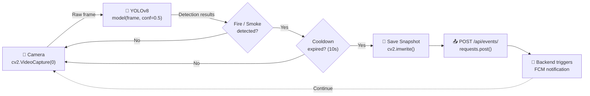
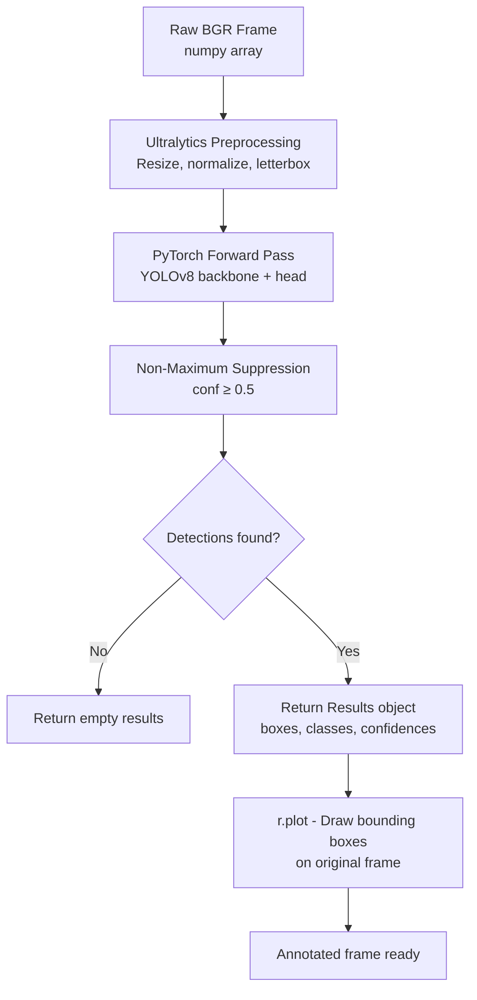
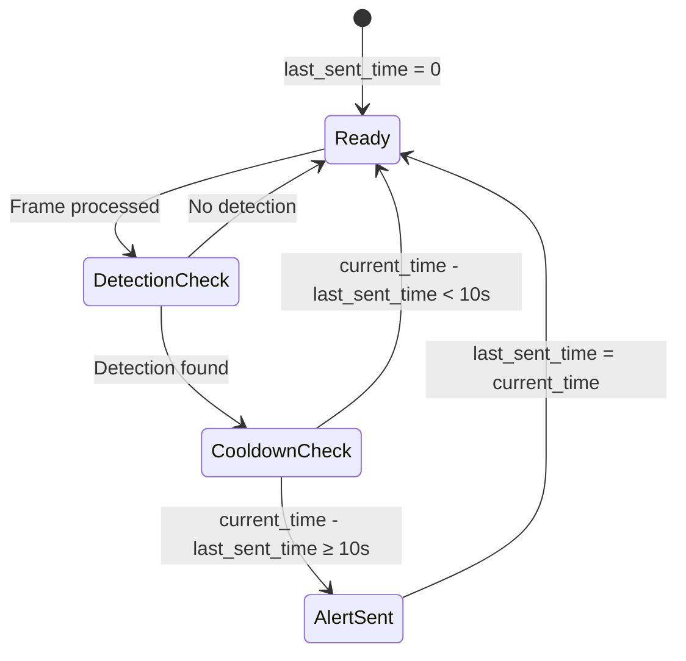
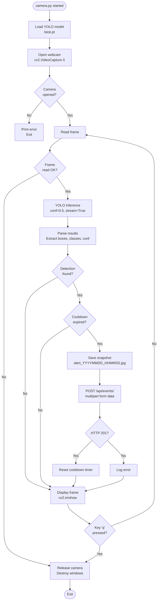

# FireGuard — AI Detection Pipeline

## 1. Overview

The AI detection pipeline is the entry point of the FireGuard system. It runs as a standalone Python script (`ai_service/camera.py`) on a local machine equipped with a webcam or USB camera. The script continuously captures video frames, performs YOLOv8 object detection for fire and smoke, and reports positive detections to the Django backend via HTTP POST requests.

---

## 2. Pipeline Architecture



---

## 3. camera.py Workflow

The complete workflow of `camera.py` follows these steps:

### 3.1 Initialization

```python
# Load the custom-trained YOLOv8 model
model = YOLO('best.pt')

# Backend API endpoint for event creation
API_URL = "https://bodareda0001.pythonanywhere.com/api/events/"

# Cooldown state
last_sent_time = 0
COOLDOWN_SECONDS = 10

# Camera reference (from Django database)
CAMERA_ID = 1

# Open the default webcam
cap = cv2.VideoCapture(0)
```

| Parameter | Value | Description |
|-----------|-------|-------------|
| `model` | `YOLO('best.pt')` | Custom-trained YOLOv8 model for fire/smoke detection |
| `API_URL` | `https://bodareda0001.pythonanywhere.com/api/events/` | Production Django backend endpoint |
| `COOLDOWN_SECONDS` | `10` | Minimum seconds between consecutive alerts |
| `CAMERA_ID` | `1` | Hardcoded reference to the camera record in the backend database |
| `cap` | `cv2.VideoCapture(0)` | Default system webcam (index 0) |

### 3.2 Main Detection Loop

```python
while True:
    ret, frame = cap.read()
    if not ret:
        break

    # Run YOLO prediction
    results = model(frame, conf=0.5, stream=True)

    detected = False
    label = None
    confidence = 0
    annotated_frame = frame

    for r in results:
        annotated_frame = r.plot()  # Draw bounding boxes
        if r.boxes is not None and len(r.boxes) > 0:
            for box in r.boxes:
                cls_id = int(box.cls[0])
                confidence = float(box.conf[0]) * 100  # Convert to percentage
                label = r.names[cls_id].lower()
                detected = True
                break  # Use first detection only
```

### 3.3 Cooldown Check and Alert Dispatch

```python
    current_time = time.time()

    if detected and (current_time - last_sent_time > COOLDOWN_SECONDS):
        # Save annotated snapshot
        timestamp = datetime.datetime.now().strftime("%Y%m%d_%H%M%S")
        image_name = f"alert_{timestamp}.jpg"
        cv2.imwrite(image_name, annotated_frame)

        # POST to Django backend
        with open(image_name, "rb") as img_file:
            files = {"snapshot": img_file}
            data = {
                "camera": CAMERA_ID,
                "event_type": label,          # "fire" or "smoke"
                "ai_confidence": confidence,   # 0-100 scale
                "notes": "Detected automatically by AI system"
            }
            response = requests.post(API_URL, files=files, data=data)

        if response.status_code == 201:
            last_sent_time = current_time  # Reset cooldown

    # Display live feed
    cv2.imshow("Fire & Smoke Detection", annotated_frame)

    if cv2.waitKey(1) & 0xFF == ord('q'):
        break

cap.release()
cv2.destroyAllWindows()
```

---

## 4. OpenCV Integration

OpenCV serves two purposes in the pipeline:

### 4.1 Frame Capture

```python
cap = cv2.VideoCapture(0)  # Open default webcam
ret, frame = cap.read()     # Read a single BGR frame (numpy array)
```

- The camera index `0` refers to the system's default webcam device.
- For an external WiFi camera connected via USB, the OS maps it to a device index that OpenCV can access.
- Frames are returned as NumPy arrays in BGR format, which is the native format for both OpenCV and the Ultralytics YOLO library.

### 4.2 Snapshot Generation and Display

```python
cv2.imwrite(image_name, annotated_frame)        # Save annotated frame to disk
cv2.imshow("Fire & Smoke Detection", annotated_frame)  # Display live feed
```

- `cv2.imwrite` saves the annotated frame (with YOLOv8 bounding boxes drawn by `r.plot()`) as a JPEG file.
- `cv2.imshow` opens a window displaying the live detection feed for operator monitoring during demo sessions.
- The display window is closed when the user presses `q`.

---

## 5. YOLOv8 Inference Pipeline

### 5.1 Model Loading

```python
from ultralytics import YOLO
model = YOLO('best.pt')
```

- The model file `best.pt` is a custom-trained YOLOv8 checkpoint stored in the `ai_service/` directory.
- The model was trained to detect two classes: **fire** and **smoke**.
- The Ultralytics library handles model loading, preprocessing, inference, and postprocessing internally.

### 5.2 Inference Call

```python
results = model(frame, conf=0.5, stream=True)
```

| Parameter | Value | Description |
|-----------|-------|-------------|
| `frame` | NumPy array (BGR) | Raw frame from OpenCV capture |
| `conf` | `0.5` | Minimum confidence threshold (50%) |
| `stream` | `True` | Memory-efficient generator mode for sequential processing |

### 5.3 Result Processing

```python
for r in results:
    annotated_frame = r.plot()  # Frame with drawn bounding boxes

    if r.boxes is not None and len(r.boxes) > 0:
        for box in r.boxes:
            cls_id = int(box.cls[0])         # Class index (0=fire, 1=smoke)
            confidence = float(box.conf[0]) * 100  # Confidence as percentage
            label = r.names[cls_id].lower()  # Class name: "fire" or "smoke"
            detected = True
            break  # Process only the first (highest-confidence) detection
```

### 5.4 Inference Pipeline Diagram



---

## 6. Confidence Thresholds

| Threshold | Value | Location | Purpose |
|-----------|-------|----------|---------|
| YOLOv8 inference `conf` | `0.5` (50%) | `camera.py` line 42 | Minimum confidence for YOLO to report a detection |
| Backend validation range | `0.0 – 100.0` | `events/serializers.py` | Validates incoming `ai_confidence` values |

The confidence value undergoes the following transformation:

```
YOLO output (0.0 – 1.0) × 100 → ai_confidence (0.0 – 100.0) → stored in FireEvent
```

For example, a YOLO confidence of `0.875` is converted to `87.5` before being sent to the backend.

---

## 7. Cooldown Mechanism

The cooldown prevents the system from flooding the backend with duplicate alerts for the same ongoing fire event.



| Parameter | Value | Description |
|-----------|-------|-------------|
| `COOLDOWN_SECONDS` | `10` | Minimum interval between consecutive alerts |
| `last_sent_time` | Unix timestamp | Time of the most recent successful alert |
| Reset condition | `response.status_code == 201` | Cooldown timer only resets on successful API response |

**Behavior:**
- First detection is always sent (since `last_sent_time` starts at `0`).
- Subsequent detections within the 10-second window are suppressed.
- The cooldown timer resets only when the backend successfully creates the event (HTTP 201).
- If the API call fails, the cooldown does not reset, allowing retry on the next detection.

---

## 8. Snapshot Generation

When a detection passes the cooldown check, an annotated snapshot is saved:

```python
timestamp = datetime.datetime.now().strftime("%Y%m%d_%H%M%S")
image_name = f"alert_{timestamp}.jpg"
cv2.imwrite(image_name, annotated_frame)
```

| Attribute | Value |
|-----------|-------|
| Format | JPEG |
| Naming | `alert_YYYYMMDD_HHMMSS.jpg` |
| Content | Frame with YOLOv8 bounding boxes and labels drawn |
| Storage | Local filesystem (same directory as `camera.py`) |
| Upload | Sent as multipart file in the `snapshot` field of the POST request |

The annotated frame is produced by `r.plot()`, which draws bounding boxes, class labels, and confidence scores directly on the frame using Ultralytics' built-in visualization.

---

## 9. Backend Event Reporting

The detection event is reported to the backend as a multipart POST request:

### 9.1 Request Format

```http
POST /api/events/ HTTP/1.1
Content-Type: multipart/form-data

camera=1
event_type=fire
ai_confidence=87.5
notes=Detected automatically by AI system
snapshot=@alert_20260528_143000.jpg
```

### 9.2 Request Fields

| Field | Type | Example | Description |
|-------|------|---------|-------------|
| `camera` | integer | `1` | Foreign key to the Camera record in Django |
| `event_type` | string | `fire` or `smoke` | Detection class from YOLOv8 |
| `ai_confidence` | float | `87.5` | Confidence percentage (0–100) |
| `notes` | string | `Detected automatically by AI system` | Static note identifying automated detection |
| `snapshot` | file | `alert_20260528_143000.jpg` | Annotated JPEG image |

### 9.3 Response

On success (HTTP 201):

```json
{
    "message": "Event created and notification sent.",
    "event": {
        "id": 42,
        "camera": 1,
        "camera_detail": { "id": 1, "name": "Warehouse Cam A", "location": "Building 3", "status": "online" },
        "zone_name": "Storage Area",
        "zone_id": 1,
        "event_type": "fire",
        "status": "active",
        "ai_confidence": 87.5,
        "snapshot": "/media/snapshots/alert_20260528_143000.jpg",
        "notes": "Detected automatically by AI system",
        "detected_at": "2026-05-28T14:30:00Z",
        "resolved_at": null
    },
    "fcm": {
        "status": "sent",
        "success_count": 3,
        "failure_count": 0
    }
}
```

### 9.4 Validation Rules

The `FireEventCreateSerializer` enforces:

| Rule | Implementation |
|------|---------------|
| `ai_confidence` range | Must be between `0.0` and `100.0` |
| Camera status | Cannot create an event for an `offline` camera |
| Required fields | `camera`, `event_type`, `ai_confidence` |

---

## 10. Runtime Processing Flow



---

## 11. Dependencies

| Package | Version | Purpose |
|---------|---------|---------|
| `ultralytics` | ≥ 8.0.0, < 9.0.0 | YOLOv8 model loading and inference |
| `opencv-python` | ≥ 4.8.0, < 5.0.0 | Webcam capture, image encoding, GUI display |
| `torch` | ≥ 2.0.0, < 3.0.0 | PyTorch backend (required by Ultralytics) |
| `numpy` | ≥ 1.24.0, < 2.0.0 | Array operations (transitive, pinned for stability) |
| `pillow` | ≥ 10.0.0, < 13.0.0 | Image processing (transitive, used by Ultralytics) |
| `requests` | ≥ 2.28.0, < 3.0.0 | HTTP POST to Django backend |

---

## 12. Limitations

- **Single camera only** — The script uses a hardcoded `CAMERA_ID = 1` and `cv2.VideoCapture(0)`. Multi-camera support would require running multiple script instances or refactoring to accept camera configuration as parameters.
- **No authentication** — The AI service does not authenticate with the backend. The `POST /api/events/` endpoint uses `AllowAny` permission.
- **Local snapshot storage** — Snapshots are saved in the script's working directory and are not automatically cleaned up.
- **Hardcoded API URL** — The production API URL is hardcoded in the script. This should be moved to an environment variable for flexibility.
- **First detection only** — When multiple objects are detected in a single frame, only the first detection is processed (`break` after the first box).
- **No GPU requirement** — The model can run on CPU, but inference speed depends on hardware capabilities.
