# FireGuard — Architecture

## 1. High-Level Architecture

FireGuard follows a **three-tier architecture** composed of an edge AI service, a centralized backend API, and a mobile client. The tiers communicate asynchronously through HTTP and Firebase Cloud Messaging.

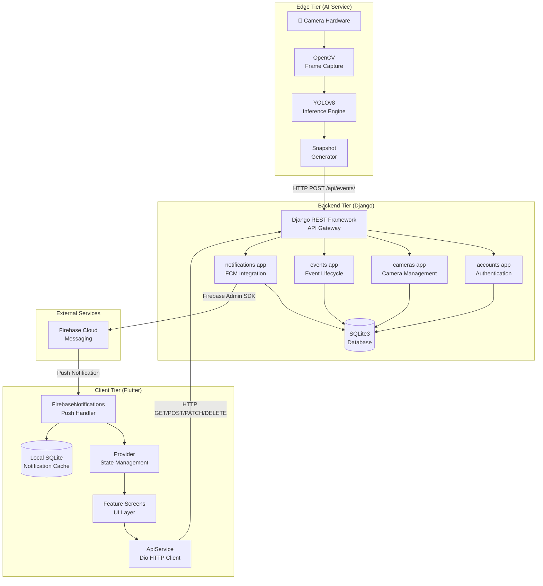

---

## 2. Component Responsibilities

### 2.1 AI Service — Edge Tier

| Component | File | Responsibility |
|-----------|------|---------------|
| Camera Capture | `camera.py` | Opens webcam via `cv2.VideoCapture(0)`, reads frames in a loop |
| YOLOv8 Inference | `camera.py` | Loads `best.pt`, runs `model(frame, conf=0.5, stream=True)` |
| Cooldown Controller | `camera.py` | Enforces 10-second minimum interval between alerts |
| Snapshot Generator | `camera.py` | Saves annotated frames as `alert_YYYYMMDD_HHMMSS.jpg` |
| Event Reporter | `camera.py` | Sends `POST /api/events/` with multipart form data (snapshot + metadata) |
| Display Window | `camera.py` | Shows live detection feed via `cv2.imshow()` |

### 2.2 Django Backend — Backend Tier

| App | Responsibility | Key Models |
|-----|---------------|------------|
| `fireguard` | Project configuration, URL routing, Firebase initialization | — |
| `accounts` | User registration, authentication (Token), profile management | `UserProfile` |
| `cameras` | Camera and zone CRUD, status management, statistics | `Zone`, `Camera` |
| `events` | Fire event lifecycle (create, list, resolve, false alarm, stats) | `FireEvent` |
| `notifications` | FCM device management, notification preferences, push dispatch | `FCMDevice`, `NotificationPreference` |

### 2.3 Flutter Mobile App — Client Tier

| Layer | Component | Responsibility |
|-------|-----------|---------------|
| **Services** | `ApiService` | Dio-based HTTP client with token interceptor |
| **Services** | `CacheHelper` | SharedPreferences wrapper for token storage |
| **Services** | `FirebaseNotifications` | FCM initialization, foreground/background handling, local notification display |
| **Services** | `DatabaseService` | Local SQLite for offline notification history |
| **State** | `AuthProvider` | Login/logout state, token management |
| **State** | `CameraProvider` | Camera list, CRUD operations state |
| **State** | `ActivityProvider` | Event history list, resolve actions |
| **State** | `HomeProvider` | Dashboard statistics |
| **Navigation** | `GoRouter` | Declarative route definitions, deep linking from notifications |
| **UI** | Feature screens | Splash, Login, Signup, Home, Cameras, Alert, Activity, Settings, Profile |

---

## 3. Integration Workflow

### 3.1 Event Creation Flow

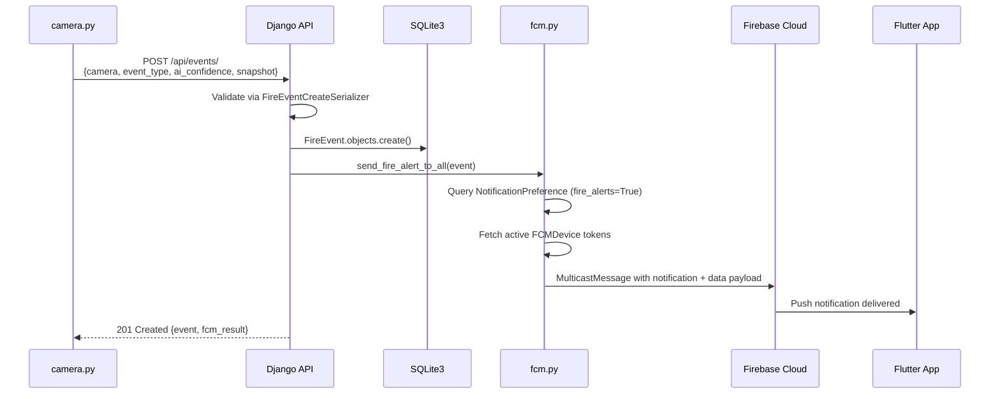

### 3.2 Event Resolution Flow

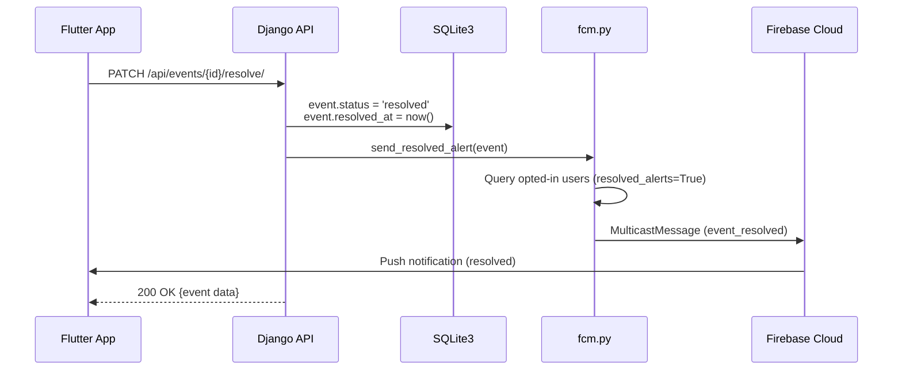

### 3.3 User Authentication Flow

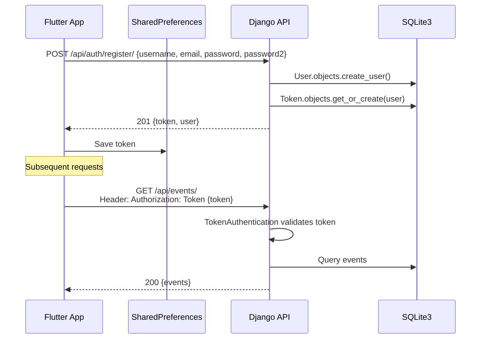

---

## 4. Runtime Workflow

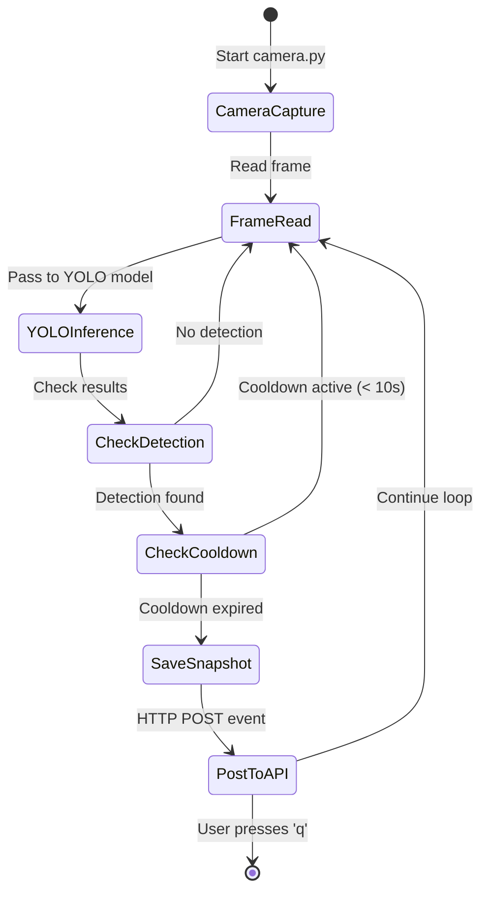

---

## 5. Detection Workflow

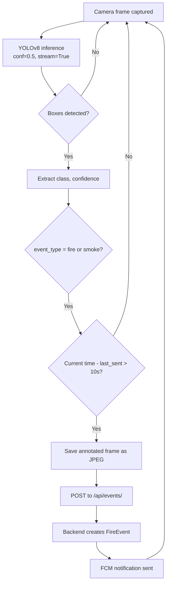

---

## 6. Notification Workflow

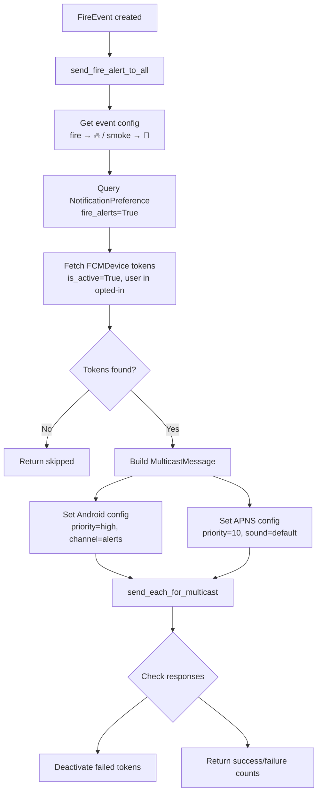

### Notification Payload Structure

The FCM message includes both a `notification` object (for system tray display) and a `data` object (for client-side routing):

```json
{
  "notification": {
    "title": "🔥 Fire Detected!",
    "body": "Building 3, Floor 2 — Storage Area — 87.5% confidence"
  },
  "data": {
    "type": "fire_alert",
    "event_id": "42",
    "camera_id": "1",
    "camera_name": "Warehouse Cam A",
    "location": "Building 3, Floor 2",
    "zone": "Storage Area",
    "event_type": "fire",
    "ai_confidence": "87.5",
    "detected_at": "2026-05-28T14:30:00+00:00"
  }
}
```

---

## 7. Deployment Architecture

The current deployment uses the following infrastructure:

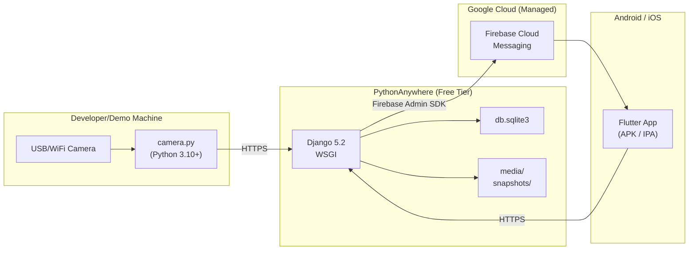

### Deployment Notes

- The Django backend runs as a WSGI application on PythonAnywhere. The `Procfile` contains `web: gunicorn fireguard.wsgi`.
- Static files are served from the `staticfiles/` directory via PythonAnywhere's static file configuration.
- Media files (snapshots, avatars, camera thumbnails) are stored in the `media/` directory on the PythonAnywhere filesystem.
- The AI service (`camera.py`) runs on a local machine and requires a physical camera connection. It communicates with the deployed backend over HTTPS.
- Firebase credentials are stored as a JSON file on the server (not in version control).

---

## 8. Activity Diagram — Complete System Flow

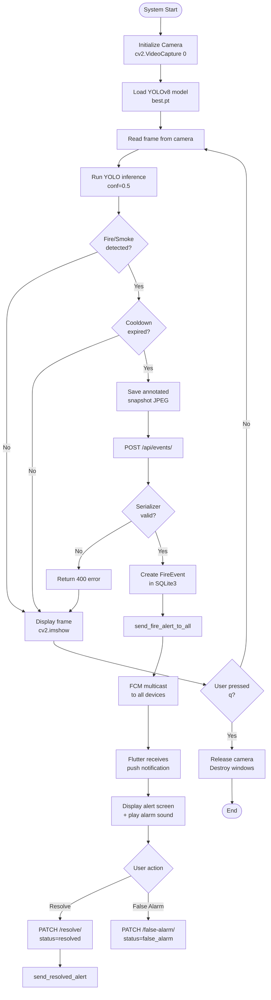

---

## 9. DFD — Level 0 (Context Diagram)

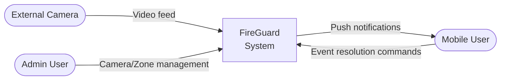

## 10. DFD — Level 1

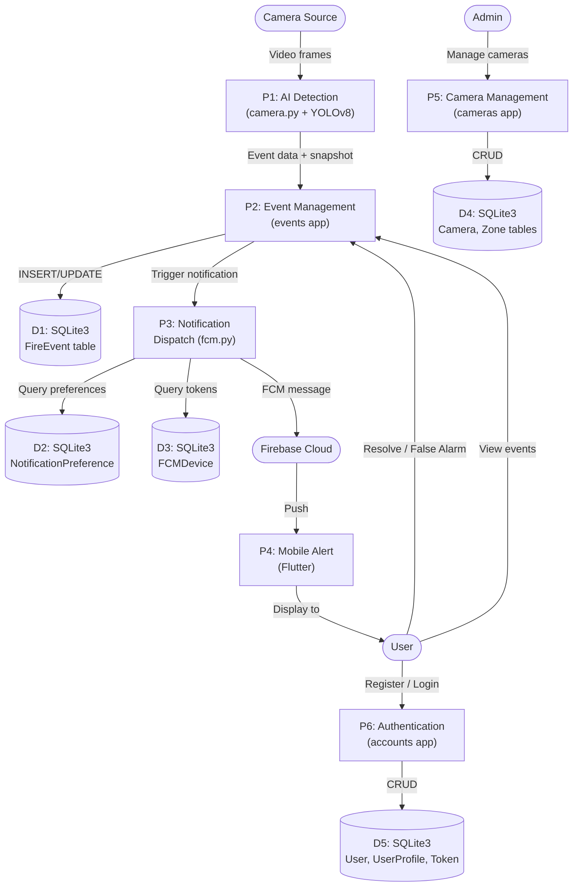
