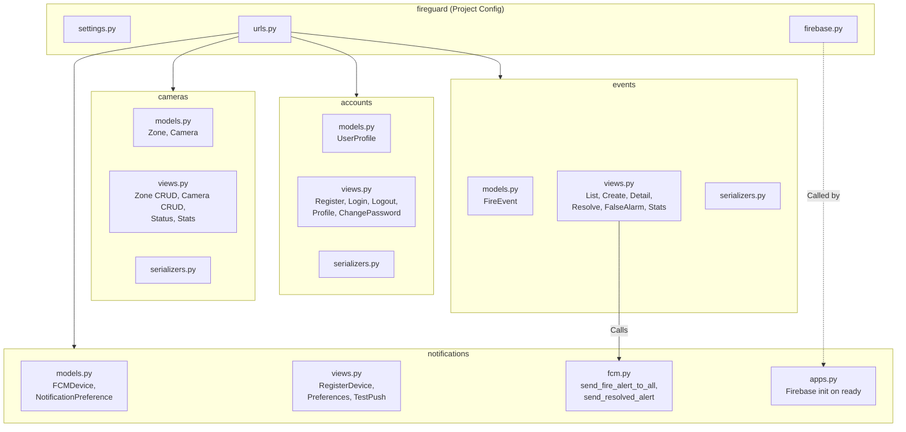
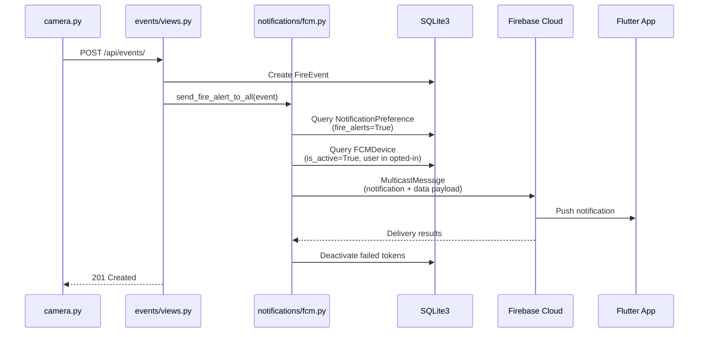

# FireGuard — Backend

## 1. Overview

The FireGuard backend is a Django 5.2 application using Django REST Framework (DRF) 3.17. It provides a RESTful API for event management, camera/zone management, user authentication, and push notification dispatch. The backend uses SQLite3 as its database and Firebase Admin SDK for sending push notifications via Firebase Cloud Messaging (FCM).

**Deployment:** PythonAnywhere (`bodareda0001.pythonanywhere.com`)

---

## 2. Django Project Structure

```
backend/
├── fireguard/                  # Django project package
│   ├── __init__.py
│   ├── settings.py             # Project settings
│   ├── urls.py                 # Root URL configuration
│   ├── firebase.py             # Firebase Admin SDK initialization
│   ├── wsgi.py                 # WSGI entry point
│   └── asgi.py                 # ASGI entry point
├── accounts/                   # User authentication & profiles
├── cameras/                    # Camera & zone management
├── events/                     # Fire event lifecycle
├── notifications/              # FCM device & notification management
├── manage.py                   # Django management command
├── requirements.txt            # Python dependencies
└── firebase_credentials.json   # Firebase service account (not in VCS)
```

---

## 3. Django App Architecture



---

## 4. DRF Configuration

From `fireguard/settings.py`:

```python
REST_FRAMEWORK = {
    'DEFAULT_AUTHENTICATION_CLASSES': [
        'rest_framework.authentication.TokenAuthentication',
    ],
    'DEFAULT_PERMISSION_CLASSES': [
        'rest_framework.permissions.IsAuthenticated',
    ],
    'DEFAULT_PAGINATION_CLASS': 'rest_framework.pagination.PageNumberPagination',
    'PAGE_SIZE': 20,
}
```

| Setting | Value | Description |
|---------|-------|-------------|
| Authentication | Token Authentication | Token sent via `Authorization: Token <key>` header |
| Default Permission | `IsAuthenticated` | All endpoints require authentication unless overridden |
| Pagination | `PageNumberPagination` | 20 results per page |

---

## 5. API Endpoints

### 5.1 Root URL Configuration

```python
urlpatterns = [
    path('admin/',              admin.site.urls),
    path('api/auth/',           include('accounts.urls')),
    path('api/cameras/',        include('cameras.urls')),
    path('api/events/',         include('events.urls')),
    path('api/notifications/',  include('notifications.urls')),
]
```

### 5.2 Authentication Endpoints (`/api/auth/`)

| Method | Endpoint | View | Permission | Description |
|--------|----------|------|------------|-------------|
| POST | `/api/auth/register/` | `RegisterView` | AllowAny | Create a new user account |
| POST | `/api/auth/login/` | `LoginView` | AllowAny | Authenticate and receive token |
| POST | `/api/auth/logout/` | `LogoutView` | IsAuthenticated | Delete auth token (force re-login) |
| GET | `/api/auth/profile/` | `ProfileView` | IsAuthenticated | Get current user profile |
| PATCH | `/api/auth/profile/` | `ProfileView` | IsAuthenticated | Update profile (name, email, phone, avatar) |
| POST | `/api/auth/change-password/` | `ChangePasswordView` | IsAuthenticated | Change password (regenerates token) |

#### Register — Request/Response

```http
POST /api/auth/register/
Content-Type: application/json

{
    "username": "johndoe",
    "email": "john@example.com",
    "first_name": "John",
    "last_name": "Doe",
    "password": "SecurePass123!",
    "password2": "SecurePass123!"
}
```

```json
{
    "message": "Account created successfully.",
    "token": "a1b2c3d4e5f6...",
    "user": {
        "id": 1,
        "username": "johndoe",
        "email": "john@example.com",
        "first_name": "John",
        "last_name": "Doe",
        "is_staff": false,
        "profile": {
            "phone": null,
            "avatar": null
        }
    }
}
```

#### Login — Request/Response

```http
POST /api/auth/login/
Content-Type: application/json

{
    "username": "johndoe",
    "password": "SecurePass123!"
}
```

```json
{
    "message": "Login successful.",
    "token": "a1b2c3d4e5f6...",
    "user": {
        "id": 1,
        "username": "johndoe",
        "email": "john@example.com",
        "first_name": "John",
        "last_name": "Doe",
        "is_staff": false,
        "profile": {
            "phone": null,
            "avatar": null
        }
    }
}
```

### 5.3 Camera & Zone Endpoints (`/api/cameras/`)

| Method | Endpoint | View | Permission | Description |
|--------|----------|------|------------|-------------|
| GET | `/api/cameras/zones/` | `ZoneListCreateView` | Authenticated (Read) | List all zones with camera counts |
| POST | `/api/cameras/zones/` | `ZoneListCreateView` | Admin Only (Write) | Create a new zone |
| GET | `/api/cameras/zones/{id}/` | `ZoneDetailView` | Authenticated | Get zone details |
| PUT | `/api/cameras/zones/{id}/` | `ZoneDetailView` | Admin Only | Full zone update |
| PATCH | `/api/cameras/zones/{id}/` | `ZoneDetailView` | Admin Only | Partial zone update |
| DELETE | `/api/cameras/zones/{id}/` | `ZoneDetailView` | Admin Only | Delete a zone |
| GET | `/api/cameras/cameras/` | `CameraListCreateView` | Authenticated | List cameras (filterable by `zone`, `status`) |
| POST | `/api/cameras/cameras/` | `CameraListCreateView` | Admin Only | Create a new camera |
| GET | `/api/cameras/cameras/{id}/` | `CameraDetailView` | Authenticated | Get camera details |
| PUT | `/api/cameras/cameras/{id}/` | `CameraDetailView` | Admin Only | Full camera update |
| PATCH | `/api/cameras/cameras/{id}/` | `CameraDetailView` | Admin Only | Partial camera update |
| DELETE | `/api/cameras/cameras/{id}/` | `CameraDetailView` | Admin Only | Delete a camera |
| PATCH | `/api/cameras/cameras/{id}/status/` | `CameraStatusUpdateView` | Admin Only | Update camera online/offline status |
| GET | `/api/cameras/stats/` | `CameraStatsView` | Authenticated | Get camera statistics (total, online, offline) |

**Permission model:** `IsAdminOrReadOnly` — any authenticated user can read; only `is_staff` users can create, update, or delete.

### 5.4 Event Endpoints (`/api/events/`)

| Method | Endpoint | View | Permission | Description |
|--------|----------|------|------------|-------------|
| GET | `/api/events/` | `FireEventListCreateView` | IsAuthenticated | List events (filterable by `status`, `camera`, `zone`, `type`) |
| POST | `/api/events/` | `FireEventListCreateView` | **AllowAny** | Create an event (used by AI service) |
| GET | `/api/events/{id}/` | `FireEventDetailView` | IsAuthenticated | Get event details |
| PATCH | `/api/events/{id}/` | `FireEventDetailView` | IsAuthenticated | Update event notes |
| PATCH | `/api/events/{id}/resolve/` | `ResolveEventView` | IsAuthenticated | Mark event as resolved |
| PATCH | `/api/events/{id}/false-alarm/` | `FalseAlarmView` | IsAuthenticated | Mark event as false alarm |
| GET | `/api/events/active/` | `ActiveEventView` | IsAuthenticated | Get the most recent active event |
| GET | `/api/events/stats/` | `EventStatsView` | IsAuthenticated | Get aggregate event counts |

> **Important:** The `POST /api/events/` endpoint uses `AllowAny` permission to allow the AI service (`camera.py`) to create events without user authentication.

#### Create Event — Request/Response

```http
POST /api/events/
Content-Type: multipart/form-data

camera=1
event_type=fire
ai_confidence=87.5
notes=Detected automatically by AI system
snapshot=@alert_20260528_143000.jpg
```

```json
{
    "message": "Event created and notification sent.",
    "event": {
        "id": 42,
        "camera": 1,
        "camera_detail": {
            "id": 1,
            "name": "Warehouse Cam A",
            "location": "Building 3, Floor 2",
            "zone": 1,
            "zone_name": "Storage Area",
            "status": "online"
        },
        "zone_name": "Storage Area",
        "zone_id": 1,
        "event_type": "fire",
        "status": "active",
        "ai_confidence": 87.5,
        "snapshot": "/media/snapshots/alert_20260528_143000.jpg",
        "notes": "Detected automatically by AI system",
        "detected_at": "2026-05-28T14:30:00Z",
        "resolved_at": null
    },
    "fcm": {
        "status": "sent",
        "success_count": 3,
        "failure_count": 0
    }
}
```

#### Event Stats — Response

```json
{
    "total": 150,
    "fire": 95,
    "smoke": 55,
    "active": 2,
    "resolved": 140,
    "false_alarm": 8
}
```

### 5.5 Notification Endpoints (`/api/notifications/`)

| Method | Endpoint | View | Permission | Description |
|--------|----------|------|------------|-------------|
| POST | `/api/notifications/register-device/` | `RegisterDeviceView` | IsAuthenticated | Register/update FCM device token |
| DELETE | `/api/notifications/unregister-device/` | `UnregisterDeviceView` | IsAuthenticated | Unregister FCM device token |
| GET | `/api/notifications/preferences/` | `NotificationPreferenceView` | IsAuthenticated | Get notification preferences |
| PATCH | `/api/notifications/preferences/` | `NotificationPreferenceView` | IsAuthenticated | Update notification preferences |
| POST | `/api/notifications/test-push/` | `TestPushView` | IsAuthenticated | Send a test push notification |

#### Register Device — Request/Response

```http
POST /api/notifications/register-device/
Content-Type: application/json
Authorization: Token a1b2c3d4e5f6...

{
    "token": "fcm-device-token-string...",
    "platform": "android"
}
```

```json
{
    "message": "Device registered.",
    "device": {
        "id": 1,
        "token": "fcm-device-token-string...",
        "platform": "android",
        "is_active": true,
        "created_at": "2026-05-28T14:00:00Z"
    }
}
```

---

## 6. Models Overview

### 6.1 accounts.UserProfile

```python
class UserProfile(models.Model):
    user       = models.OneToOneField(User, on_delete=models.CASCADE, related_name='profile')
    phone      = models.CharField(max_length=20, blank=True, null=True)
    avatar     = models.ImageField(upload_to='avatars/', blank=True, null=True)
    created_at = models.DateTimeField(auto_now_add=True)
    updated_at = models.DateTimeField(auto_now=True)
```

- Auto-created via `post_save` signal when a new `User` is created.
- Extends Django's built-in `User` model with `phone` and `avatar` fields.

### 6.2 cameras.Zone

```python
class Zone(models.Model):
    name        = models.CharField(max_length=100)
    description = models.TextField(blank=True, null=True)
    created_at  = models.DateTimeField(auto_now_add=True)
```

- Represents a logical grouping of cameras (e.g., "Storage Area", "Main Hall").

### 6.3 cameras.Camera

```python
class Camera(models.Model):
    STATUS_CHOICES = [('online', 'Online'), ('offline', 'Offline')]

    zone        = models.ForeignKey(Zone, on_delete=models.CASCADE, related_name='cameras')
    name        = models.CharField(max_length=100)
    location    = models.CharField(max_length=200)
    stream_url  = models.URLField(blank=True, null=True)
    thumbnail   = models.ImageField(upload_to='cameras/', blank=True, null=True)
    status      = models.CharField(max_length=10, choices=STATUS_CHOICES, default='online')
    created_at  = models.DateTimeField(auto_now_add=True)
    updated_at  = models.DateTimeField(auto_now=True)
```

- Belongs to a `Zone` (foreign key relationship).
- Status can be `online` or `offline`.

### 6.4 events.FireEvent

```python
class FireEvent(models.Model):
    STATUS_CHOICES = [
        ('active', 'Active'), ('resolved', 'Resolved'), ('false_alarm', 'False Alarm')
    ]
    EVENT_TYPE_CHOICES = [('fire', 'Fire'), ('smoke', 'Smoke')]

    camera        = models.ForeignKey(Camera, on_delete=models.CASCADE, related_name='events')
    event_type    = models.CharField(max_length=10, choices=EVENT_TYPE_CHOICES)
    status        = models.CharField(max_length=15, choices=STATUS_CHOICES, default='active')
    ai_confidence = models.FloatField()
    snapshot      = models.ImageField(upload_to='snapshots/', blank=True, null=True)
    notes         = models.TextField(blank=True, null=True)
    detected_at   = models.DateTimeField(auto_now_add=True)
    resolved_at   = models.DateTimeField(blank=True, null=True)
```

- Core model representing a fire or smoke detection event.
- Status lifecycle: `active` → `resolved` or `false_alarm`.
- Ordered by `-detected_at` (most recent first).

### 6.5 notifications.FCMDevice

```python
class FCMDevice(models.Model):
    PLATFORM_CHOICES = [('android', 'Android'), ('ios', 'iOS')]

    user        = models.ForeignKey(User, on_delete=models.CASCADE, related_name='fcm_devices')
    token       = models.TextField(unique=True)
    platform    = models.CharField(max_length=10, choices=PLATFORM_CHOICES, default='android')
    is_active   = models.BooleanField(default=True)
    created_at  = models.DateTimeField(auto_now_add=True)
    updated_at  = models.DateTimeField(auto_now=True)
```

- Stores FCM device tokens registered by the Flutter app.
- `is_active` is set to `False` when a token fails during push notification delivery.

### 6.6 notifications.NotificationPreference

```python
class NotificationPreference(models.Model):
    user                = models.OneToOneField(User, on_delete=models.CASCADE, related_name='notification_prefs')
    fire_alerts         = models.BooleanField(default=True)
    resolved_alerts     = models.BooleanField(default=True)
    false_alarm_alerts  = models.BooleanField(default=False)
    sound_enabled       = models.BooleanField(default=True)
    created_at          = models.DateTimeField(auto_now_add=True)
    updated_at          = models.DateTimeField(auto_now=True)
```

- Auto-created via `post_save` signal when a new `User` is created.
- Per-user control over which notification types are received.

---

## 7. Serializers

| Serializer | App | Purpose |
|-----------|-----|---------|
| `RegisterSerializer` | accounts | User registration with password validation |
| `UserSerializer` | accounts | Full user object with nested profile |
| `UserProfileSerializer` | accounts | Profile fields (phone, avatar) |
| `UpdateProfileSerializer` | accounts | Nested User + Profile update |
| `ChangePasswordSerializer` | accounts | Old/new password validation |
| `ZoneSerializer` | cameras | Zone with annotated `camera_count` |
| `CameraSerializer` | cameras | Camera with `zone_name` annotation |
| `CameraStatusSerializer` | cameras | Camera status update only |
| `FireEventSerializer` | events | Full event with nested camera detail |
| `FireEventCreateSerializer` | events | Event creation with validation (confidence range, camera status) |
| `FireEventUpdateSerializer` | events | Event notes update only |
| `FCMDeviceSerializer` | notifications | Device token with platform |
| `NotificationPreferenceSerializer` | notifications | User notification preferences |

---

## 8. Firebase Integration

### 8.1 Initialization

Firebase Admin SDK is initialized once at Django startup via `NotificationsConfig.ready()`:

```python
# notifications/apps.py
class NotificationsConfig(AppConfig):
    name = 'notifications'

    def ready(self):
        from fireguard.firebase import initialize_firebase
        initialize_firebase()
```

```python
# fireguard/firebase.py
def initialize_firebase():
    if not firebase_admin._apps:
        cred = credentials.Certificate(settings.FIREBASE_CREDENTIALS_PATH)
        firebase_admin.initialize_app(cred)
```

### 8.2 Notification Dispatch (fcm.py)

The `notifications/fcm.py` module contains three functions:

| Function | Trigger | Recipients | Notification Type |
|----------|---------|-----------|------------------|
| `send_fire_alert_to_all(event)` | Event creation | Users with `fire_alerts=True` | `fire_alert` or `smoke_alert` |
| `send_resolved_alert(event)` | Event resolution | Users with `resolved_alerts=True` | `event_resolved` |
| `send_test_push(token)` | Manual test | Single device token | `test` |

### 8.3 Failed Token Handling

After each multicast send, the system checks for failed deliveries and deactivates invalid tokens:

```python
def _handle_failed_tokens(tokens, response):
    failed_tokens = [
        tokens[i]
        for i, resp in enumerate(response.responses)
        if not resp.success
    ]
    if failed_tokens:
        FCMDevice.objects.filter(token__in=failed_tokens).update(is_active=False)
```

---

## 9. Notification Workflow Diagram



---

## 10. SQLite3 Configuration

```python
# fireguard/settings.py
DATABASES = {
    'default': {
        'ENGINE': 'django.db.backends.sqlite3',
        'NAME': BASE_DIR / 'db.sqlite3',
    }
}
```

The SQLite3 database file (`db.sqlite3`) is stored in the `backend/` directory. Django ORM manages all schema migrations via `python manage.py migrate`.

---

## 11. Backend Dependencies

| Package | Version | Purpose |
|---------|---------|---------|
| `Django` | 5.2.13 | Web framework |
| `djangorestframework` | 3.17.1 | REST API construction |
| `django-cors-headers` | 4.9.0 | Cross-origin request handling |
| `firebase_admin` | 7.4.0 | Firebase Admin SDK for FCM |
| `python-dotenv` | 1.2.2 | Environment variable loading |
| `pillow` | 12.2.0 | Image field support |
| `requests` | 2.33.1 | HTTP utilities |
| `gunicorn` | 21.2.0 | Production WSGI server |
