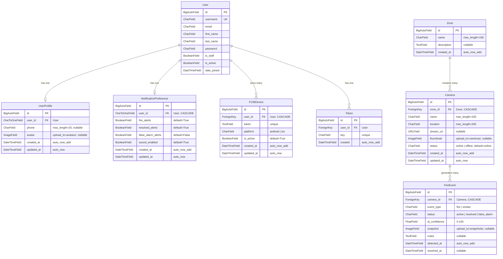
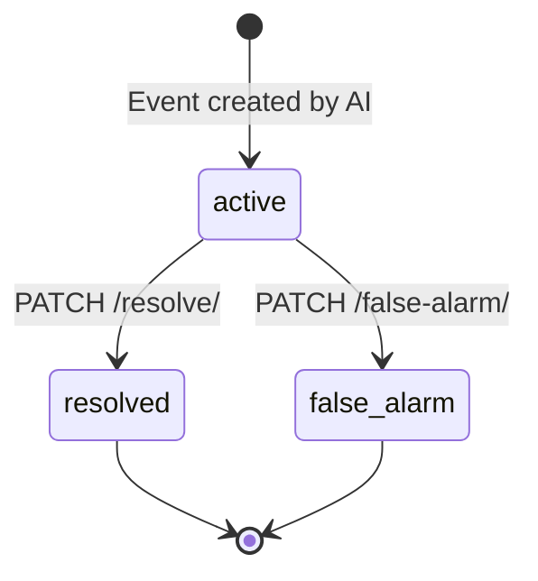
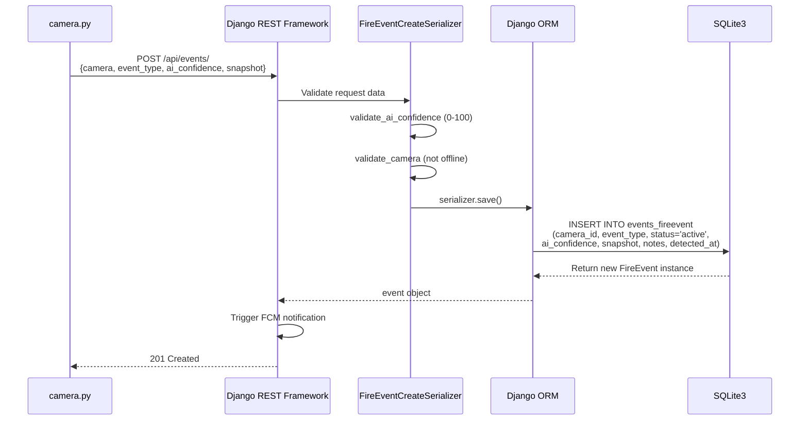

# FireGuard — Database

## 1. Overview

FireGuard uses **SQLite3** as its server-side database, managed entirely through the Django ORM. The database file (`db.sqlite3`) resides in the `backend/` directory and is created/updated via Django migrations.

Additionally, the Flutter mobile application uses a **separate local SQLite database** (`fire_guard.db`) on the device for caching notification history offline.

---

## 2. SQLite3 Configuration

### 2.1 Server-Side (Django Backend)

```python
# fireguard/settings.py
DATABASES = {
    'default': {
        'ENGINE': 'django.db.backends.sqlite3',
        'NAME': BASE_DIR / 'db.sqlite3',
    }
}
```

| Parameter | Value | Description |
|-----------|-------|-------------|
| Engine | `django.db.backends.sqlite3` | Django's built-in SQLite backend |
| Database file | `backend/db.sqlite3` | File-based storage, no separate server process |
| Migration tool | `python manage.py migrate` | Django ORM generates and applies schema changes |
| Default PK | `BigAutoField` | 64-bit auto-incrementing integer primary keys |

### 2.2 Client-Side (Flutter App)

```dart
// core/services/database_service.dart
Future<Database> _initDB(String filePath) async {
    final dbPath = await getDatabasesPath();
    final path = join(dbPath, filePath);
    return await openDatabase(path, version: 2, onCreate: _createDB);
}
```

| Parameter | Value | Description |
|-----------|-------|-------------|
| Database name | `fire_guard.db` | Stored in the app's sandboxed directory |
| Package | `sqflite` | Flutter SQLite plugin |
| Schema version | `2` | Current schema version |

---

## 3. Entity Relationship Diagram



---

## 4. Database Entities

### 4.1 User (Django built-in `auth_user`)

The standard Django `User` model from `django.contrib.auth.models`.

| Field | Type | Constraints | Description |
|-------|------|------------|-------------|
| `id` | BigAutoField | PK | Auto-incrementing primary key |
| `username` | CharField(150) | Unique, required | Login username |
| `email` | CharField(254) | Optional | User email address |
| `first_name` | CharField(150) | Optional | First name |
| `last_name` | CharField(150) | Optional | Last name |
| `password` | CharField(128) | Required | Hashed password |
| `is_staff` | BooleanField | Default: False | Admin access flag |
| `is_active` | BooleanField | Default: True | Account active flag |
| `date_joined` | DateTimeField | Auto | Registration timestamp |

### 4.2 UserProfile (`accounts_userprofile`)

| Field | Type | Constraints | Description |
|-------|------|------------|-------------|
| `id` | BigAutoField | PK | Auto-incrementing primary key |
| `user_id` | OneToOneField | FK → User, CASCADE | One-to-one link to User |
| `phone` | CharField(20) | Nullable | Phone number |
| `avatar` | ImageField | Nullable, upload_to=`avatars/` | Profile picture |
| `created_at` | DateTimeField | auto_now_add | Creation timestamp |
| `updated_at` | DateTimeField | auto_now | Last update timestamp |

**Auto-creation:** Created automatically via `post_save` signal when a new `User` is created.

### 4.3 Zone (`cameras_zone`)

| Field | Type | Constraints | Description |
|-------|------|------------|-------------|
| `id` | BigAutoField | PK | Auto-incrementing primary key |
| `name` | CharField(100) | Required | Zone name (e.g., "Storage Area") |
| `description` | TextField | Nullable | Zone description |
| `created_at` | DateTimeField | auto_now_add | Creation timestamp |

### 4.4 Camera (`cameras_camera`)

| Field | Type | Constraints | Description |
|-------|------|------------|-------------|
| `id` | BigAutoField | PK | Auto-incrementing primary key |
| `zone_id` | ForeignKey | FK → Zone, CASCADE | Parent zone |
| `name` | CharField(100) | Required | Camera display name |
| `location` | CharField(200) | Required | Physical location description |
| `stream_url` | URLField | Nullable | Camera stream URL |
| `thumbnail` | ImageField | Nullable, upload_to=`cameras/` | Camera thumbnail image |
| `status` | CharField(10) | Choices: `online`, `offline` | Current camera status |
| `created_at` | DateTimeField | auto_now_add | Registration timestamp |
| `updated_at` | DateTimeField | auto_now | Last update timestamp |

### 4.5 FireEvent (`events_fireevent`)

| Field | Type | Constraints | Description |
|-------|------|------------|-------------|
| `id` | BigAutoField | PK | Auto-incrementing primary key |
| `camera_id` | ForeignKey | FK → Camera, CASCADE | Source camera |
| `event_type` | CharField(10) | Choices: `fire`, `smoke` | Detection class |
| `status` | CharField(15) | Choices: `active`, `resolved`, `false_alarm` | Event lifecycle status |
| `ai_confidence` | FloatField | 0.0 – 100.0 | YOLOv8 confidence percentage |
| `snapshot` | ImageField | Nullable, upload_to=`snapshots/` | Annotated detection image |
| `notes` | TextField | Nullable | Event notes |
| `detected_at` | DateTimeField | auto_now_add | Detection timestamp |
| `resolved_at` | DateTimeField | Nullable | Resolution timestamp |

**Default ordering:** `-detected_at` (most recent first)

**Status lifecycle:**



### 4.6 FCMDevice (`notifications_fcmdevice`)

| Field | Type | Constraints | Description |
|-------|------|------------|-------------|
| `id` | BigAutoField | PK | Auto-incrementing primary key |
| `user_id` | ForeignKey | FK → User, CASCADE | Device owner |
| `token` | TextField | Unique | FCM device token |
| `platform` | CharField(10) | Choices: `android`, `ios` | Device platform |
| `is_active` | BooleanField | Default: True | Whether token is valid |
| `created_at` | DateTimeField | auto_now_add | Registration timestamp |
| `updated_at` | DateTimeField | auto_now | Last update timestamp |

**Token lifecycle:** Tokens are set to `is_active=False` when FCM delivery fails. The Flutter app re-registers the token on each login.

### 4.7 NotificationPreference (`notifications_notificationpreference`)

| Field | Type | Constraints | Description |
|-------|------|------------|-------------|
| `id` | BigAutoField | PK | Auto-incrementing primary key |
| `user_id` | OneToOneField | FK → User, CASCADE | Preference owner |
| `fire_alerts` | BooleanField | Default: True | Receive fire/smoke alerts |
| `resolved_alerts` | BooleanField | Default: True | Receive resolution notifications |
| `false_alarm_alerts` | BooleanField | Default: False | Receive false alarm notifications |
| `sound_enabled` | BooleanField | Default: True | Enable notification sounds |
| `created_at` | DateTimeField | auto_now_add | Creation timestamp |
| `updated_at` | DateTimeField | auto_now | Last update timestamp |

**Auto-creation:** Created automatically via `post_save` signal when a new `User` is created.

### 4.8 Token (`authtoken_token` — DRF built-in)

| Field | Type | Constraints | Description |
|-------|------|------------|-------------|
| `key` | CharField(40) | PK, unique | Authentication token string |
| `user_id` | OneToOneField | FK → User | Token owner |
| `created` | DateTimeField | auto_now_add | Token creation timestamp |

---

## 5. Relationships

| Relationship | Type | On Delete | Description |
|-------------|------|-----------|-------------|
| User → UserProfile | One-to-One | CASCADE | Each user has exactly one profile |
| User → NotificationPreference | One-to-One | CASCADE | Each user has exactly one preference set |
| User → FCMDevice | One-to-Many | CASCADE | A user can have multiple registered devices |
| User → Token | One-to-One | CASCADE | Each user has one active auth token |
| Zone → Camera | One-to-Many | CASCADE | A zone contains multiple cameras |
| Camera → FireEvent | One-to-Many | CASCADE | A camera generates multiple events |

### Cascade Deletion Behavior

- Deleting a **User** cascades to: UserProfile, NotificationPreference, all FCMDevices, Token
- Deleting a **Zone** cascades to: all Cameras in that zone → all FireEvents from those cameras
- Deleting a **Camera** cascades to: all FireEvents from that camera

---

## 6. Django ORM Integration

### 6.1 Query Patterns Used

| Pattern | Location | Example |
|---------|----------|---------|
| `select_related` | events/views.py | `FireEvent.objects.select_related('camera', 'camera__zone')` |
| `annotate` | cameras/views.py | `Zone.objects.annotate(camera_count=Count('cameras'))` |
| `filter` with query params | events/views.py | `.filter(status=event_status)`, `.filter(camera_id=camera_id)` |
| `update_or_create` | notifications/views.py | `FCMDevice.objects.update_or_create(token=token, defaults={...})` |
| `get_or_create` | accounts/views.py | `Token.objects.get_or_create(user=user)` |
| `values_list` | notifications/fcm.py | `.values_list('user_id', flat=True)` |
| Post-save signals | accounts/models.py | Auto-create UserProfile and NotificationPreference |

### 6.2 Migration Management

```bash
# Generate migration files from model changes
python manage.py makemigrations

# Apply migrations to the database
python manage.py migrate

# View migration status
python manage.py showmigrations
```

---

## 7. Event Storage Workflow



---

## 8. Client-Side Database (Flutter)

The Flutter app uses `sqflite` to maintain a local notification cache:

```sql
CREATE TABLE notifications (
    id INTEGER PRIMARY KEY AUTOINCREMENT,
    type TEXT,
    event_id TEXT UNIQUE,
    camera_id TEXT,
    camera_name TEXT,
    location TEXT,
    zone TEXT,
    event_type TEXT,
    ai_confidence REAL,
    detected_at TEXT
);
```

| Operation | Method | Description |
|-----------|--------|-------------|
| Insert | `insertNotification(AlertPayload)` | Store incoming FCM notification data |
| Read all | `getAllNotifications()` | Retrieve all cached notifications (ordered by `detected_at DESC`) |
| Clear | `clearAll()` | Delete all cached notifications |

The `event_id` field has a `UNIQUE` constraint with `ConflictAlgorithm.replace` to prevent duplicate entries.

---

## 9. Limitations

- **SQLite3 concurrency** — SQLite3 supports limited concurrent writes. This is acceptable for the graduation project but would need to be replaced with PostgreSQL for production multi-user workloads.
- **No database backup strategy** — The SQLite3 file on PythonAnywhere is not automatically backed up.
- **File-based storage** — SQLite3 is a single file (`db.sqlite3`), making it simple to deploy but not suitable for distributed or high-availability setups.
- **No database indexes** — Beyond Django's default primary key and foreign key indexes, no custom indexes are defined. Query performance is adequate for the current data volume.
