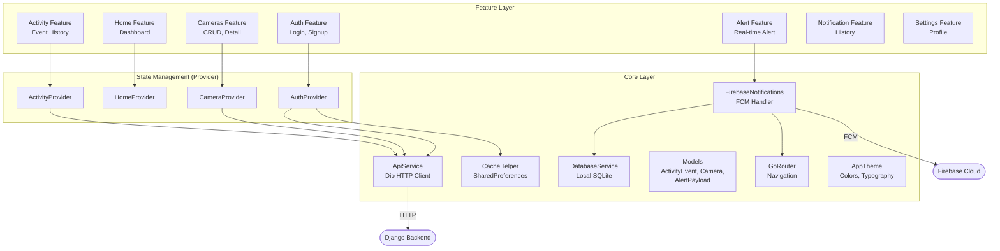
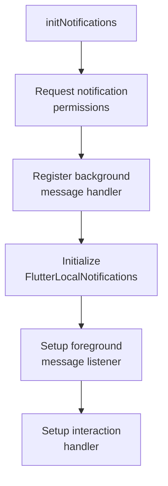
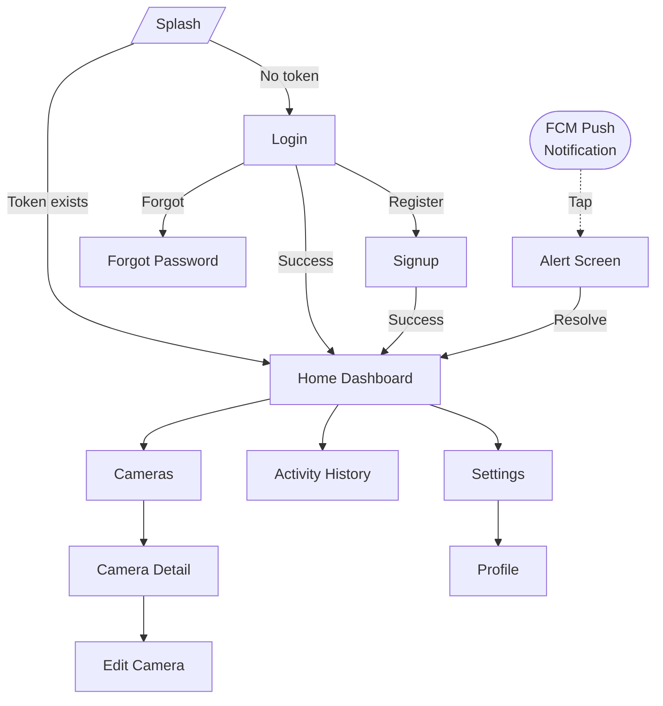
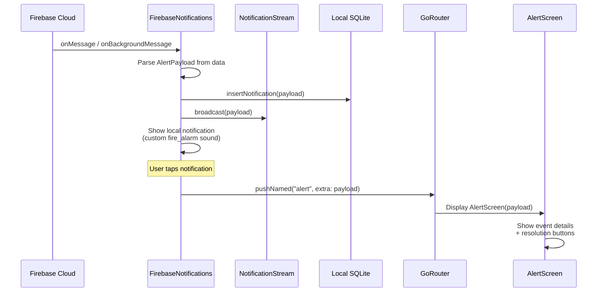

<![CDATA[# FireGuard — Mobile Application

## 1. Overview

The FireGuard mobile application is built with **Flutter 3.9** and targets both Android and iOS platforms. It provides a real-time fire and smoke alert interface, event history management, camera monitoring, and user account management. The app communicates with the Django backend via RESTful APIs (Dio HTTP client) and receives push notifications through Firebase Cloud Messaging (FCM).

---

## 2. Flutter Architecture

The application follows a **feature-first** directory structure with a shared `core` layer:

```
lib/
├── main.dart                    # App entry point
├── fire_gaurd.dart              # Root widget (MultiProvider + MaterialApp.router)
├── firebase_options.dart        # Generated Firebase configuration
├── core/                        # Shared infrastructure
│   ├── constant/                # Route name constants
│   ├── error/                   # Exception classes
│   ├── models/                  # Shared data models
│   ├── navigation/              # GoRouter configuration
│   ├── services/                # API, cache, database, notification services
│   ├── theme/                   # AppTheme, AppColors, AppTextStyle
│   └── widgets/                 # Shared UI components
└── feature/                     # Feature modules
    ├── splash/                  # Splash / auto-login screen
    ├── auth/                    # Authentication (login, signup, forgot password)
    ├── home/                    # Dashboard / home screen
    ├── cameras/                 # Camera management
    ├── activity/                # Event history
    ├── alert/                   # Real-time fire alert
    ├── notification/            # Notification history
    └── settings/                # Settings and profile
```

### Architecture Diagram



---

## 3. State Management — Provider

The app uses the **Provider** package for reactive state management. Providers are registered at the root of the widget tree via `MultiProvider` in `fire_gaurd.dart`:

```dart
MultiProvider(
  providers: [
    Provider<ApiService>(create: (_) => ApiService()),
    ProxyProvider<ApiService, AuthRepository>(
      update: (_, apiService, __) => AuthRepository(apiService),
    ),
    ProxyProvider<ApiService, CameraRepository>(
      update: (_, apiService, __) => CameraRepository(apiService),
    ),
    ProxyProvider<ApiService, ActivityRepository>(
      update: (_, apiService, __) => ActivityRepository(apiService),
    ),
    ChangeNotifierProvider<CameraProvider>(
      create: (context) => CameraProvider(
        cameraRepository: context.read<CameraRepository>(),
      ),
    ),
    ChangeNotifierProvider<AuthProvider>(
      create: (context) => AuthProvider(
        authRepository: context.read<AuthRepository>(),
      ),
    ),
    ChangeNotifierProvider<HomeProvider>(
      create: (context) => HomeProvider(),
    ),
    ChangeNotifierProvider<ActivityProvider>(
      create: (context) => ActivityProvider(
        repository: context.read<ActivityRepository>(),
      ),
    ),
  ],
  // ...
)
```

### Provider Registry

| Provider | Type | Responsibility |
|----------|------|---------------|
| `ApiService` | `Provider` | Singleton Dio HTTP client with token interceptor |
| `AuthRepository` | `ProxyProvider` | Auth API calls (login, register, logout, profile) |
| `CameraRepository` | `ProxyProvider` | Camera/Zone API calls |
| `ActivityRepository` | `ProxyProvider` | Event history API calls |
| `AuthProvider` | `ChangeNotifierProvider` | Login/logout state, token persistence |
| `CameraProvider` | `ChangeNotifierProvider` | Camera list state, CRUD operations |
| `HomeProvider` | `ChangeNotifierProvider` | Dashboard statistics |
| `ActivityProvider` | `ChangeNotifierProvider` | Event history list, resolve actions |

---

## 4. Screens

### 4.1 Screen Inventory

| Screen | Route Path | Description |
|--------|-----------|-------------|
| **SplashScreen** | `/` | Initial loading screen, checks cached token for auto-login |
| **LoginScreen** | `/login` | Email/password login form |
| **SignupScreen** | `/Singup` | User registration form |
| **ForgotPasswordScreen** | `/forgotPassword` | Password recovery screen |
| **HomeScreen** | `/home` | Dashboard with event stats and quick actions |
| **CamerasScreen** | `/livecamere` | Camera list with zone filtering |
| **CameraDetailScreen** | `/camera/:id` | Individual camera details and events |
| **EditCameraScreen** | `/editCamera` | Camera edit form |
| **ActivityHistoryScreen** | `/activityHistory` | Scrollable list of all fire events |
| **AlertScreen** | `/alert` | Full-screen real-time fire alert |
| **SettingsScreen** | `/settings` | App settings and preferences |
| **ProfileScreen** | `/profile` | User profile editing |

### 4.2 Screen Descriptions

#### Splash Screen
- Checks for a cached authentication token in SharedPreferences.
- If a valid token exists, navigates directly to the Home screen.
- If no token, navigates to the Login screen.

#### Login Screen
- Username and password input fields.
- On successful login, saves the token and registers the FCM device token with the backend.
- Navigates to the Home screen.

#### Signup Screen
- Registration form with username, email, first name, last name, password, and password confirmation.
- On successful registration, saves the token and navigates to the Home screen.

#### Home Screen (Dashboard)
- Displays summary statistics (total events, active events, fire vs. smoke counts).
- Quick action buttons for navigating to cameras, activity history, and settings.
- Central hub for the application.

#### Cameras Screen
- Lists all registered cameras with zone information and online/offline status.
- Supports filtering by zone.
- Admin users can add, edit, and delete cameras and zones.

#### Camera Detail Screen
- Displays individual camera information (name, location, zone, status, thumbnail).
- Shows the event history for this specific camera.

#### Activity History Screen
- Scrollable list of all fire events ordered by detection time (most recent first).
- Each event displays event type (fire/smoke), camera name, location, AI confidence, and status.
- Active events can be resolved directly from this screen.

#### Alert Screen
- Full-screen emergency alert displayed when a fire/smoke notification is received.
- Shows event type, camera name, location, zone, AI confidence, and detection time.
- Includes action buttons to resolve the event or dismiss the alert.
- Receives data via the `AlertPayload` model passed as route `extra`.

#### Settings Screen
- App settings and user preferences.
- Navigation to profile editing.
- Logout functionality.

#### Profile Screen
- Displays and allows editing of user information (name, email, phone, avatar).
- Password change functionality.

---

## 5. Notification Handling

### 5.1 Firebase Notification Service

The `FirebaseNotifications` class in `core/services/firebase_notifications.dart` manages all FCM-related functionality:



### 5.2 Notification Handling by App State

| App State | Handler | Behavior |
|-----------|---------|----------|
| **Foreground** | `FirebaseMessaging.onMessage` | Show local notification + broadcast via stream + store in local DB |
| **Background** | `_firebaseMessagingBackgroundHandler` | Store in local DB + show local notification with custom sound |
| **Terminated** | `getInitialMessage()` | Navigate to alert screen when app opens |
| **Notification tap** | `onMessageOpenedApp` | Navigate to alert screen with event data |

### 5.3 Local Notification Configuration

The app creates a high-priority Android notification channel with a custom fire alarm sound:

```dart
static const AndroidNotificationChannel _channel = AndroidNotificationChannel(
    'fire_emergency_v3',
    'Fire Emergency Alerts',
    description: 'High priority fire detection alerts',
    importance: Importance.max,
    playSound: true,
    sound: RawResourceAndroidNotificationSound('fire_alarm'),
);
```

### 5.4 FCM Token Registration

After login or signup, the app sends its FCM device token to the backend:

```dart
Future<void> sendTokenToBackend() async {
    String? token = await _fbm.getToken();
    if (token != null) {
        final apiService = ApiService();
        await apiService.post(Endpoints.testPushNotification, {
            'token': token,
            'platform': Platform.isAndroid ? 'android' : 'ios',
        });
    }
}
```

### 5.5 Notification Stream

The service exposes a broadcast stream that UI components can listen to for real-time updates:

```dart
static final StreamController<AlertPayload> _notificationStreamController =
    StreamController<AlertPayload>.broadcast();
static Stream<AlertPayload> get notificationStream =>
    _notificationStreamController.stream;
```

---

## 6. UI/UX Approach

### 6.1 Design System

The app uses a centralized theme defined in `core/theme/`:

| File | Purpose |
|------|---------|
| `app_theme.dart` | `ThemeData` configuration for `MaterialApp` |
| `app_colors.dart` | Color palette constants |
| `app_text_style.dart` | Typography definitions |

### 6.2 Responsive Design

The app uses `flutter_screenutil` for responsive sizing:

```dart
ScreenUtilInit(
    designSize: const Size(360, 690),
    minTextAdapt: true,
    splitScreenMode: true,
    // ...
)
```

This ensures consistent layout across different screen sizes and pixel densities.

### 6.3 UI Libraries

| Package | Version | Purpose |
|---------|---------|---------|
| `flutter_screenutil` | 5.9.3 | Responsive screen adaptation |
| `cupertino_icons` | 1.0.8 | iOS-style icons |
| `intl` | 0.20.2 | Date/time formatting |
| `image_picker` | 1.2.2 | Avatar image selection |

---

## 7. Navigation

The app uses **GoRouter** for declarative routing:

```dart
final GoRouter appRoute = GoRouter(
    initialLocation: "/",
    routes: [
        GoRoute(path: "/",              name: "splash",          builder: ... ),
        GoRoute(path: "/login",         name: "login",           builder: ... ),
        GoRoute(path: "/Singup",        name: "singup",          builder: ... ),
        GoRoute(path: "/forgotPassword",name: "forgotPassword",  builder: ... ),
        GoRoute(path: "/home",          name: "home",            builder: ... ),
        GoRoute(path: "/livecamere",    name: "cameras",         builder: ... ),
        GoRoute(path: "/camera/:id",    name: "cameraDetails",   builder: ... ),
        GoRoute(path: "/editCamera",    name: "editCamera",      builder: ... ),
        GoRoute(path: "/activityHistory",name: "activityHistory", builder: ... ),
        GoRoute(path: "/alert",         name: "alert",           builder: ... ),
        GoRoute(path: "/settings",      name: "settings",        builder: ... ),
        GoRoute(path: "/profile",       name: "profile",         builder: ... ),
    ],
);
```

### Navigation Flow Diagram



---

## 8. Alert System

### 8.1 Alert Payload Model

The `AlertPayload` class maps the FCM `data` payload to a Dart object:

```dart
class AlertPayload {
    final String type;           // "fire_alert", "smoke_alert", "event_resolved"
    final String eventId;
    final String cameraId;
    final String cameraName;
    final String location;
    final String zone;
    final String eventType;      // "fire" or "smoke"
    final double aiConfidence;
    final DateTime detectedAt;

    factory AlertPayload.fromMap(Map<String, dynamic> data) { ... }
    Map<String, dynamic> toMap() { ... }
}
```

### 8.2 Alert Flow



### 8.3 Local Notification Storage

The app maintains a local SQLite database (`fire_guard.db`) for offline notification history:

```dart
class DatabaseService {
    Future<void> insertNotification(AlertPayload payload) async { ... }
    Future<List<AlertPayload>> getAllNotifications() async { ... }
    Future<void> clearAll() async { ... }
}
```

**Table schema:**

```sql
CREATE TABLE notifications (
    id INTEGER PRIMARY KEY AUTOINCREMENT,
    type TEXT,
    event_id TEXT UNIQUE,
    camera_id TEXT,
    camera_name TEXT,
    location TEXT,
    zone TEXT,
    event_type TEXT,
    ai_confidence REAL,
    detected_at TEXT
);
```

---

## 9. API Communication

### 9.1 ApiService (Dio Client)

```dart
class ApiService {
    late final Dio dio;

    ApiService() {
        dio = Dio(BaseOptions(
            baseUrl: 'https://bodareda0001.pythonanywhere.com/',
            connectTimeout: Duration(seconds: 30),
            receiveTimeout: Duration(seconds: 30),
            headers: {'Content-Type': 'application/json'},
        ));

        // Token interceptor
        dio.interceptors.add(InterceptorsWrapper(
            onRequest: (options, handler) {
                final token = CacheHelper.getData(key: 'token');
                if (token != null) {
                    options.headers['Authorization'] = 'Token $token';
                }
                return handler.next(options);
            },
        ));
    }
}
```

### 9.2 Configured Endpoints

| Constant | Path | Description |
|----------|------|-------------|
| `login` | `api/auth/login/` | User login |
| `register` | `api/auth/register/` | User registration |
| `userProfile` | `api/auth/profile/` | Profile GET/PATCH |
| `logout` | `api/auth/logout/` | Token deletion |
| `changePassword` | `api/auth/change-password/` | Password change |
| `getCameras` | `api/cameras/cameras/` | Camera list |
| `addCamera` | `api/cameras/cameras/` | Camera creation |
| `getAllCameras` | `api/cameras/stats/` | Camera statistics |
| `getZones` | `api/cameras/zones/` | Zone list |
| `addZone` | `api/cameras/zones/` | Zone creation |
| `recentActivity` | `api/events/` | Event list |
| `resolveEvent(id)` | `api/events/{id}/resolve/` | Event resolution |
| `testPushNotification` | `api/notifications/register-device/` | FCM device registration |

---

## 10. Flutter Dependencies

| Package | Version | Purpose |
|---------|---------|---------|
| `flutter_screenutil` | ^5.9.3 | Responsive screen adaptation |
| `go_router` | ^17.2.1 | Declarative navigation |
| `provider` | ^6.1.5 | State management |
| `shared_preferences` | ^2.5.5 | Local key-value storage (auth token) |
| `dio` | ^5.9.2 | HTTP client |
| `firebase_core` | ^4.9.0 | Firebase initialization |
| `firebase_messaging` | ^16.2.2 | FCM push notifications |
| `flutter_local_notifications` | ^18.0.1 | Local notification display |
| `sqflite` | ^2.4.1 | Local SQLite database |
| `intl` | ^0.20.2 | Date/time formatting |
| `image_picker` | ^1.2.2 | Image selection for avatars |

---

## 11. Screenshot Placeholders

> The following screenshots should be added to the `screenshots/` directory:

| Screenshot | Description |
|-----------|-------------|
| `splash_screen.png` | App loading / splash screen |
| `login_screen.png` | User login screen |
| `signup_screen.png` | User registration screen |
| `home_dashboard.png` | Main dashboard with statistics |
| `camera_list.png` | Camera listing with zone grouping |
| `camera_detail.png` | Individual camera detail view |
| `activity_history.png` | Event history list |
| `alert_screen.png` | Real-time fire alert screen |
| `settings_screen.png` | App settings screen |
| `profile_screen.png` | User profile editing screen |
| `notification_history.png` | Local notification history |
]]>
