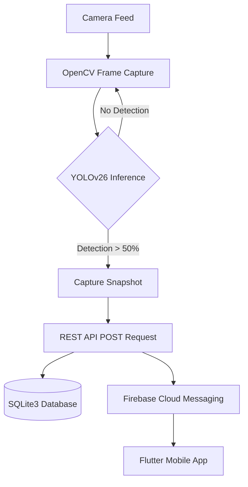
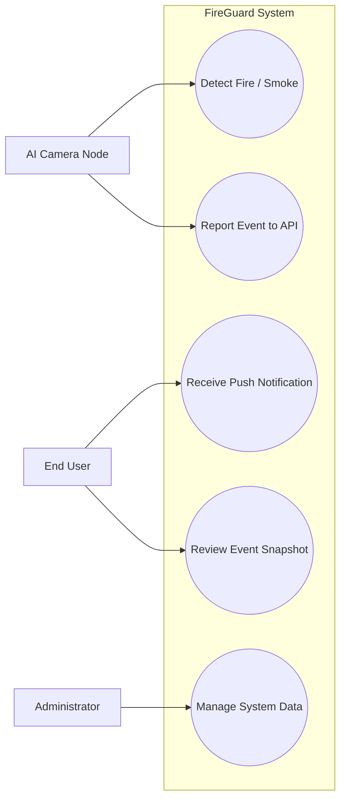
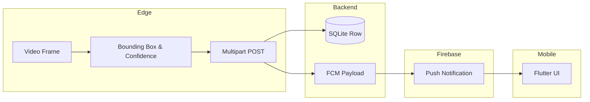
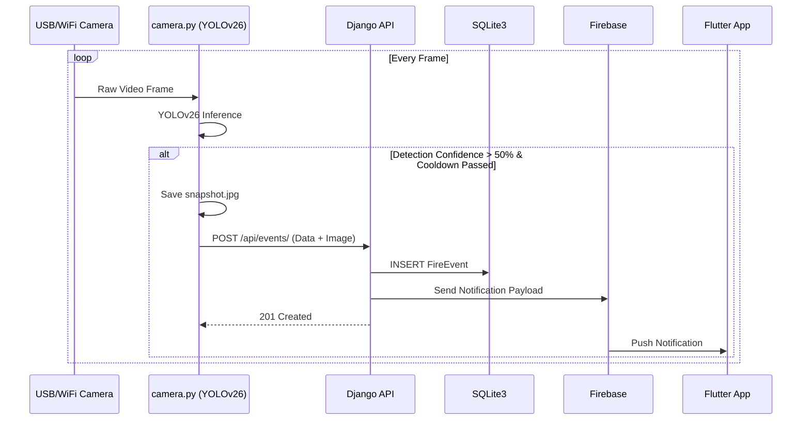

# FireGuard — System Foundation Document

## 1. Project Overview
The FireGuard system is an AI-powered fire and smoke detection and emergency alert system developed as a graduation project. It provides real-time hazard identification using computer vision and deep learning techniques. The system consists of an edge-based camera script for local inference, a central backend server for event management, and a mobile application for user notifications. By integrating these components, FireGuard aims to reduce response times during fire emergencies.

## 2. Problem Statement
Traditional fire alarm systems primarily rely on physical sensors (e.g., smoke or thermal detectors) that often require physical contact or proximity to the hazard, leading to delayed detection in large or open spaces [1]. Furthermore, conventional systems lack visual verification, making it difficult to assess the severity of the situation remotely. There is a need for an automated, visually intelligent system capable of detecting fire and smoke at an early stage and instantly alerting relevant personnel.

## 3. Proposed Solution
The proposed solution, FireGuard, utilizes a camera-based approach combined with the YOLOv26 object detection model to visually identify fire and smoke in real-time. Upon detection, the AI service transmits an event payload, including a captured snapshot and confidence metrics, to a centralized Django-based backend. The backend records the event and dispatches a push notification via Firebase Cloud Messaging (FCM) to a Flutter-based mobile application, enabling immediate remote assessment and response.

## 4. Project Objectives
*   To implement a real-time computer vision pipeline capable of detecting fire and smoke using a live camera feed.
*   To develop a RESTful API backend for centralized event logging, camera management, and notification dispatching.
*   To create a cross-platform mobile application that receives real-time alerts and displays event snapshots to users.
*   To integrate Firebase Cloud Messaging (FCM) for reliable, low-latency push notifications.

## 5. Project Scope
The scope of the current FireGuard implementation includes:
*   **AI Inference:** Local object detection using a pre-trained YOLOv26 model (`best.pt`) on video frames captured via USB/WiFi cameras.
*   **Backend Services:** A monolithic Django application utilizing Django REST Framework (DRF) for API endpoints and SQLite3 as the primary database.
*   **Mobile Client:** A Flutter mobile application designed to receive and display alert notifications.
*   **Alert Mechanism:** Image snapshots and confidence scores sent to the backend, triggering FCM push notifications.

**Out of Scope:** Distributed cloud architectures, microservices, load balancing, Kubernetes deployments, and advanced relational database management systems (e.g., PostgreSQL) are not implemented in the current project version.

## 6. Functional Requirements
*   **FR1 (Video Capture):** The AI service must capture continuous video frames from an connected camera.
*   **FR2 (Hazard Detection):** The AI service must analyze frames to detect "fire" and "smoke" with a minimum confidence threshold.
*   **FR3 (Event Transmission):** The AI service must send an HTTP POST request containing the event type, confidence score, camera ID, and a snapshot image upon successful detection.
*   **FR4 (Cooldown Mechanism):** The AI service must enforce a cooldown period (e.g., 10 seconds) between consecutive alerts to prevent API spamming.
*   **FR5 (Event Storage):** The backend must persist incoming events and their associated snapshots in the database.
*   **FR6 (Notification Dispatch):** The backend must trigger an FCM push notification to registered mobile clients when a new active event is recorded.

## 7. Non-Functional Requirements
*   **NFR1 (Performance):** The AI pipeline should process frames efficiently on local hardware to ensure near real-time detection.
*   **NFR2 (Simplicity):** The backend architecture must remain monolithic and use SQLite3 to simplify deployment for the graduation project presentation.
*   **NFR3 (Cross-Platform Compatibility):** The mobile application must be developed using Flutter to support both Android and iOS platforms using a single codebase.

## 8. System Methodology
The project follows a modular, component-based methodology, where the system is divided into three distinct layers: the Edge/AI Layer (Python/YOLOv26), the Server Layer (Django/SQLite3), and the Presentation Layer (Flutter). Communication between layers is strictly handled via HTTP/REST and FCM protocols, ensuring separation of concerns.

## 9. High-Level System Workflow
1.  **Capture:** The `camera.py` script opens a local video capture stream using OpenCV.
2.  **Inference:** Frames are passed to the YOLOv26 model for inference.
3.  **Detection:** If the model detects fire or smoke with a confidence > 50%, an event is triggered.
4.  **Reporting:** The script saves a local snapshot and sends a POST request with multipart form data to the Django REST API (`/api/events/`).
5.  **Storage & Push:** The Django backend saves the event in the SQLite3 database and triggers a push notification via the Firebase Admin SDK.
6.  **Alerting:** The Flutter mobile application receives the FCM payload and notifies the user.

*Figure 1: High-Level System Workflow Placeholder*

## 10. System Architecture Explanation
The FireGuard architecture is a classic client-server model augmented with an edge-inference node.
*   **Edge Node:** A Python script (`camera.py`) running locally with an attached camera. It handles the computationally expensive task of computer vision locally.
*   **Monolithic Backend:** Hosted on a single server (e.g., PythonAnywhere), a Django application serves as the central hub. It uses Django REST Framework to expose endpoints (`urls.py`) and an SQLite3 database (`db.sqlite3`) for persistent storage.
*   **Mobile Client:** A Flutter application that acts as the end-user interface.

```mermaid
architecture-beta
    group edge(server)[Edge Node]
    group cloud(server)[Backend Server]
    group mobile(device)[End User]

    service cam(camera)[Webcam USB Camera] in edge
    service ai(server)[Python AI Script] in edge
    
    service api(server)[Django REST API] in cloud
    service db(database)[SQLite3 Database] in cloud
    service fcm(cloud)[Firebase FCM] in cloud

    service app(mobile)[Flutter Mobile App] in mobile

    cam:R -- L:ai
    ai:R -- L:api
    api:B -- T:db
    api:R -- L:fcm
    fcm:R -- L:app
```

## 11. Technology Stack Analysis
*   **AI/Computer Vision:** Python, OpenCV (`cv2`), PyTorch, Ultralytics YOLOv26 (`best.pt`).
*   **Backend Framework:** Django, Django REST Framework (DRF), Django CORS Headers.
*   **Database:** SQLite3 (Local file-based relational database). Advanced RDBMS are not implemented in the current project version.
*   **Mobile Application:** Dart, Flutter framework.
*   **Third-Party Services:** Firebase Admin SDK (Backend), Firebase Cloud Messaging (Frontend/Backend).

## 12. System Components Description
*   **`ai_service/camera.py`**: The core AI execution script. Manages the video loop, executes the YOLOv26 model, handles the 10-second cooldown logic, and formats the multipart API request.
*   **`backend/events/models.py`**: Defines the `FireEvent` schema, including fields for `camera`, `event_type` (fire/smoke), `status` (active/resolved/false_alarm), `ai_confidence`, and `snapshot` image.
*   **`backend/fireguard/firebase.py`**: Handles the initialization of the Firebase Admin SDK using a local `firebase_credentials.json` file.
*   **`frontend/lib/`**: Contains the Flutter UI code, Firebase initialization (`firebase_options.dart`), and core application logic.

## 13. Actor Analysis
*   **AI Camera Node (System Actor):** Continuously monitors the environment and reports positive detections to the backend.
*   **End User (Human Actor):** Receives push notifications on their mobile device and reviews event details and snapshots.
*   **System Administrator (Human Actor):** Manages the backend via the Django Admin panel (managing cameras, users, and reviewing event logs).

## 14. Use Case Analysis
*   **UC1: Detect Hazard:** The AI Node detects fire/smoke in the camera feed.
*   **UC2: Report Event:** The AI Node uploads the event data and snapshot to the server.
*   **UC3: Receive Notification:** The End User receives an alert on their mobile device.
*   **UC4: Review Event:** The End User opens the app to view the event snapshot, confidence score, and timestamp.
*   **UC5: Manage System Data:** The System Administrator manages cameras and views all generated events.

## 15. Data Flow Overview
Data flows unidirectionally from the physical environment to the end user.
1. Visual data is ingested as pixel arrays by OpenCV.
2. The YOLOv26 model outputs bounding boxes, class IDs, and confidence tensors.
3. The AI script formats this into JSON data and binary image data.
4. The backend deserializes the data, creates an SQLite database record, and formats an FCM message payload.
5. FCM routes the JSON payload to the specific mobile device token.

## 16. Integration Workflow
Integration between the AI script and the backend is achieved via a RESTful POST endpoint (`/api/events/`). The script uses the Python `requests` library to send `files={"snapshot": img_file}` and `data={"camera": 1, "event_type": label, "ai_confidence": confidence}`. The backend uses DRF serializers to validate this input before database insertion. Firebase integration is achieved via the `firebase-admin` Python package on the backend and the `firebase_core` Flutter package on the frontend.

## 17. End-to-End Runtime Workflow

## 18. Testing Overview
Testing in the current project scope primarily consists of:
*   **Live AI Testing:** Running `camera.py` against videos of fire or controlled flames to verify detection accuracy and bounding box rendering.
*   **API Testing:** Using the Django browsable API or tools like Postman to ensure the `/api/events/` endpoint correctly accepts multipart form data and creates database records.
*   **Integration Testing:** End-to-end testing verifying that an AI detection successfully triggers a mobile notification on a physical device.
*   **Note:** Comprehensive automated unit testing (e.g., PyTest, Flutter widget tests) is not extensively implemented in the current project version.

## 19. Limitations
*   **Database Scalability:** The system relies on SQLite3, which is prone to write-locking issues under high concurrency. It is suitable for a graduation project but not for enterprise scalability.
*   **Single-Node AI:** The AI script currently runs on a single edge device tied to a single camera (`cv2.VideoCapture(0)`). Distributed camera stream processing is not implemented.
*   **Synchronous Processing:** API requests in the AI script are synchronous, which may drop video frames if the network connection to the backend is slow.
*   **Security:** The current AI script sends requests without robust token-based authentication headers (relies on open endpoints or hardcoded camera IDs).

## 20. Future Improvements
*   **Database Migration:** Migrate from SQLite3 to PostgreSQL to support concurrent database writes and better scalability.
*   **Asynchronous Processing:** Implement asynchronous API requests in `camera.py` or use a message broker (e.g., RabbitMQ, Celery) on the backend.
*   **Advanced Authentication:** Secure the REST API using JWT (JSON Web Tokens) or strict API key validation for edge devices.
*   **Multi-Camera Support:** Update the AI service to support RTSP streams from multiple IP cameras simultaneously using threading or multiprocessing.

---
*Generated for the FireGuard Graduation Project Documentation.*
