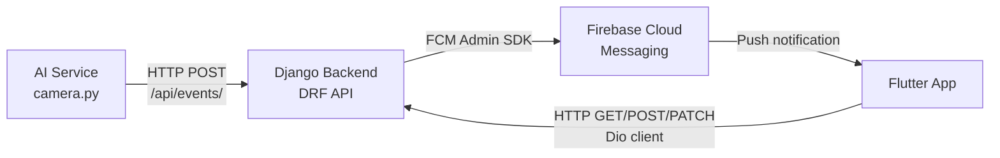
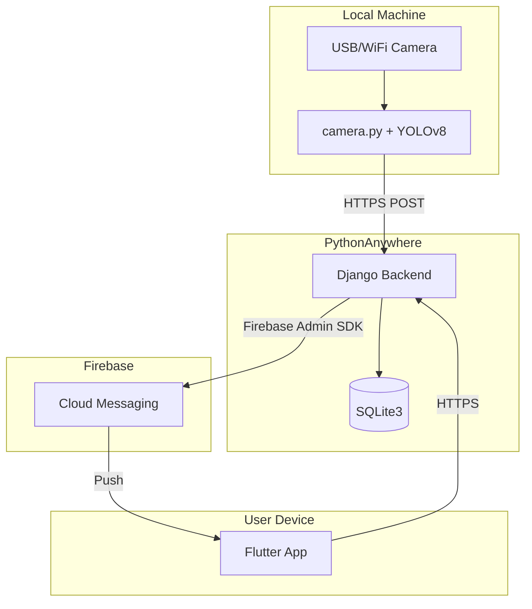

<![CDATA[# FireGuard — System Overview

## 1. Introduction

**FireGuard** is a graduation project that implements an AI-powered fire and smoke detection system with real-time mobile notifications. The system combines computer vision inference at the edge with a centralized backend and a cross-platform mobile application to provide end-to-end fire safety monitoring.

This document provides a high-level overview of the system's purpose, scope, components, and operational workflow.

---

## 2. Problem Domain

Fire hazards in buildings, warehouses, and industrial facilities require rapid detection and immediate response. Traditional fire detection systems based on smoke detectors and heat sensors suffer from:

- **Limited spatial coverage** — Physical sensors only monitor their immediate vicinity.
- **Delayed triggering** — Smoke must physically reach the sensor before activation.
- **High false-alarm rates** — Environmental factors (cooking, steam, dust) trigger unnecessary alerts.
- **No visual verification** — Responders cannot visually confirm an alert before dispatching resources.

Vision-based fire detection addresses these limitations by analyzing camera feeds in real time, providing both detection and visual evidence of potential fire events.

---

## 3. System Scope

FireGuard is scoped as a **graduation project prototype** demonstrating the following capabilities:

| Capability | Status |
|-----------|--------|
| Real-time fire and smoke detection from a webcam | ✅ Implemented |
| Event storage with status lifecycle management | ✅ Implemented |
| Push notifications via Firebase Cloud Messaging | ✅ Implemented |
| Mobile application with alert and management UI | ✅ Implemented |
| Camera and zone management | ✅ Implemented |
| User authentication and profile management | ✅ Implemented |
| Notification preferences (per-user opt-in/opt-out) | ✅ Implemented |
| Multi-camera concurrent processing | ❌ Not implemented in the current project version |
| Web-based admin dashboard | ❌ Not implemented in the current project version |
| Video clip recording | ❌ Not implemented in the current project version |
| CI/CD pipeline | ❌ Not implemented in the current project version |

---

## 4. System Components

The system is composed of three independent components that communicate over HTTP and Firebase Cloud Messaging:

### 4.1 AI Service (`ai_service/`)

A standalone Python script (`camera.py`) that runs on a machine with access to a webcam or USB camera. It performs:

- Frame capture via OpenCV (`cv2.VideoCapture`)
- Object detection via YOLOv8 (Ultralytics `YOLO` class)
- Cooldown-based alert throttling (10-second interval)
- Snapshot generation (annotated JPEG frames)
- HTTP POST requests to the Django backend

**Runtime dependencies:** `ultralytics`, `opencv-python`, `torch`, `requests`

### 4.2 Backend (`backend/`)

A Django 5.2 application using Django REST Framework 3.17 that provides:

- **Accounts app** — User registration, login, logout, profile management, password change (Token authentication)
- **Cameras app** — Zone and camera CRUD, camera status management, camera statistics
- **Events app** — FireEvent creation, listing, filtering, detail, resolution, false-alarm marking, event statistics
- **Notifications app** — FCM device registration/unregistration, notification preferences, test push, and the core `fcm.py` module for sending multicast messages

**Database:** SQLite3 (file-based, managed by Django ORM)
**Deployment:** PythonAnywhere (`bodareda0001.pythonanywhere.com`)

### 4.3 Mobile Application (`frontend/`)

A Flutter 3.9 application using Provider for state management. Feature modules include:

- **Splash** — Initial loading screen with auto-login check
- **Auth** — Login, signup, and forgot password screens
- **Home** — Dashboard with summary statistics and quick actions
- **Cameras** — Camera and zone listing, details, add/edit/delete
- **Activity** — Historical event list with status and details
- **Alert** — Full-screen real-time fire alert with resolution actions
- **Notification** — Local notification history (stored in on-device SQLite)
- **Settings** — User settings and profile management

**Key packages:** `dio`, `provider`, `go_router`, `firebase_messaging`, `flutter_local_notifications`, `sqflite`, `flutter_screenutil`

---

## 5. Component Communication

| Path | Protocol | Authentication | Description |
|------|----------|---------------|-------------|
| AI → Backend | HTTP POST | None (AllowAny) | Event creation from detection pipeline |
| Mobile → Backend | HTTP (Dio) | Token Authentication | All user-facing API calls |
| Backend → FCM | Firebase Admin SDK | Service Account JSON | Server-to-FCM push dispatch |
| FCM → Mobile | Firebase Cloud Messaging | Firebase project config | Push notification delivery |

> **Note:** The `POST /api/events/` endpoint uses `AllowAny` permission to allow the AI service to report events without user authentication. All other endpoints require token authentication.

---

## 6. Data Flow Summary

1. **Detection** — The AI service captures frames, runs YOLOv8 inference, and reports detections to the backend.
2. **Storage** — The backend stores the event in SQLite3 with status `active`.
3. **Notification** — The backend sends an FCM multicast message to all eligible devices.
4. **Alert** — The mobile app receives the notification, plays an alarm sound, and displays the alert screen.
5. **Resolution** — The user reviews the event and marks it as `resolved` or `false_alarm`.
6. **Confirmation** — The backend updates the event status and optionally sends a resolved notification.

---

## 7. Deployment Architecture

| Component | Deployment Target | Notes |
|-----------|------------------|-------|
| AI Service | Local machine with camera access | Requires webcam, Python 3.10+, GPU optional |
| Django Backend | PythonAnywhere | Free tier, SQLite3 file-based database |
| Firebase | Google Cloud (managed) | FCM for push notifications |
| Flutter App | Android / iOS device | Built and installed via `flutter run` |

---

## 8. Security Considerations

| Aspect | Implementation |
|--------|---------------|
| User authentication | Django REST Framework Token Authentication |
| Password validation | Django built-in validators (similarity, length, common, numeric) |
| CORS | `django-cors-headers` with `CORS_ALLOW_ALL_ORIGINS = True` (development setting) |
| Firebase credentials | Service account JSON file, path configured via environment variable |
| Secret key | Loaded from `.env` file, not hardcoded |
| Event creation endpoint | `AllowAny` permission (allows unauthenticated AI service access) |

> **Note:** The `AllowAny` permission on the event creation endpoint and `CORS_ALLOW_ALL_ORIGINS = True` are development/demo configurations. In a production environment, these should be restricted with API key authentication and explicit CORS origins.

---

## 9. Limitations

- **Single camera** — The current `camera.py` script supports one camera at a time (`cv2.VideoCapture(0)`).
- **SQLite3** — Not suitable for high-concurrency production workloads.
- **No HTTPS on local AI** — The AI service communicates over plain HTTP when targeting localhost.
- **No automated testing** — No unit or integration test suites are implemented.
- **Manual deployment** — No CI/CD pipeline; deployment is manual.
- **PythonAnywhere free tier** — Subject to resource and bandwidth limitations.
]]>
