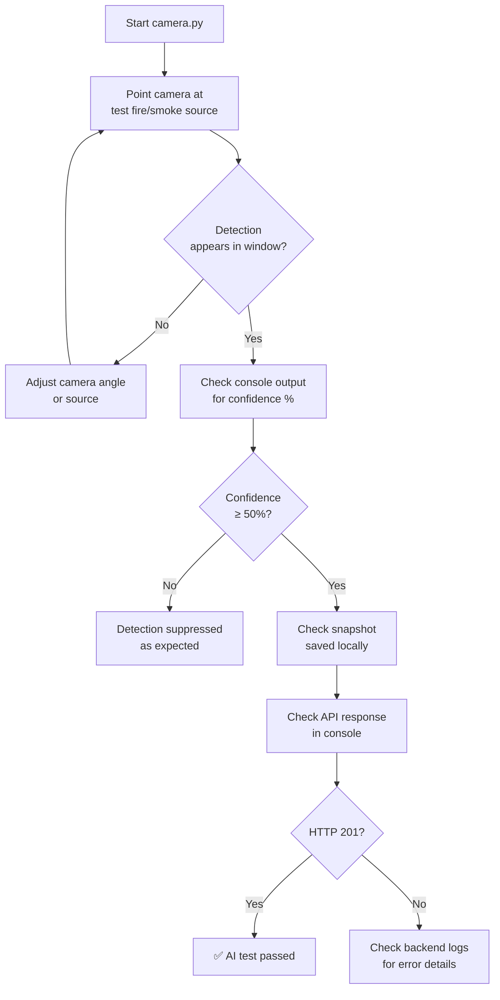
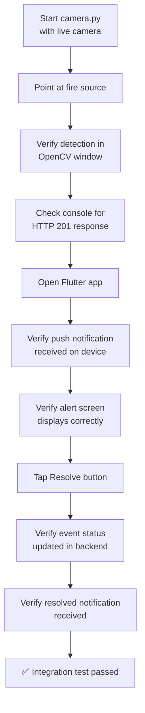

<![CDATA[# FireGuard — Testing

## 1. Overview

This document describes the testing approaches used and available for the FireGuard system. The project is a graduation prototype; formal automated test suites (unit tests, integration tests) are **not implemented in the current project version**. Testing has been performed primarily through manual verification, live demo sessions, and interactive API testing.

---

## 2. Testing Summary

| Testing Category | Status | Approach |
|-----------------|--------|----------|
| AI model accuracy testing | ✅ Manual | Verified during training and live demo |
| API endpoint testing | ✅ Manual | Tested via DRF browsable API and HTTP clients |
| FCM notification testing | ✅ Manual | Test push endpoint + live device verification |
| Mobile app testing | ✅ Manual | Manual QA on Android devices |
| End-to-end integration | ✅ Manual | Live demo with camera → backend → mobile flow |
| Automated unit tests | ❌ Not implemented | Django `tests.py` files contain no test cases |
| Automated integration tests | ❌ Not implemented | No test suites configured |
| CI/CD pipeline | ❌ Not implemented | No automated testing pipeline |

---

## 3. AI Testing

### 3.1 Model Evaluation

The YOLOv8 model (`best.pt`) was evaluated during the training process using standard object detection metrics:

| Metric | Description | Evaluated During |
|--------|-------------|-----------------|
| Precision | Ratio of true positive detections to all positive detections | Model training |
| Recall | Ratio of true positive detections to all actual positives | Model training |
| mAP@0.5 | Mean Average Precision at IoU threshold 0.5 | Model training |
| mAP@0.5:0.95 | Mean Average Precision across IoU thresholds 0.5–0.95 | Model training |

> **Note:** Specific metric values from the training run are not stored in the repository. The model was trained using the Ultralytics YOLOv8 framework, which outputs these metrics during training. See the Ultralytics documentation for the training pipeline details.

### 3.2 Live Detection Testing

| Test Scenario | Method | Expected Result | Status |
|--------------|--------|-----------------|--------|
| Fire detection (real flame) | Point camera at controlled fire source | Bounding box with "fire" label, confidence ≥ 50% | ✅ Verified |
| Smoke detection | Point camera at smoke source | Bounding box with "smoke" label, confidence ≥ 50% | ✅ Verified |
| No fire/smoke (normal scene) | Point camera at normal environment | No detections, no alerts sent | ✅ Verified |
| Cooldown mechanism | Two rapid detections within 10s | Only first detection triggers alert | ✅ Verified |
| Snapshot generation | Detection triggers snapshot save | JPEG file created with bounding boxes | ✅ Verified |
| Low-confidence rejection | Detection with confidence < 50% | No alert triggered | ✅ Verified |

### 3.3 AI Testing Workflow



---

## 4. API Testing

### 4.1 Manual API Testing

API endpoints were tested using the following methods:

| Method | Tool | Description |
|--------|------|-------------|
| DRF Browsable API | Browser | Django REST Framework's built-in HTML form interface at each endpoint |
| HTTP Client | Postman / cURL | Manual request construction for all endpoints |
| Admin Panel | Django Admin | Direct database inspection and data management |

### 4.2 API Test Cases

#### Authentication Endpoints

| Test Case | Method | Endpoint | Expected Status | Verified |
|-----------|--------|----------|----------------|----------|
| Register new user | POST | `/api/auth/register/` | 201 Created | ✅ |
| Register duplicate username | POST | `/api/auth/register/` | 400 Bad Request | ✅ |
| Register duplicate email | POST | `/api/auth/register/` | 400 Bad Request | ✅ |
| Register mismatched passwords | POST | `/api/auth/register/` | 400 Bad Request | ✅ |
| Login valid credentials | POST | `/api/auth/login/` | 200 OK + token | ✅ |
| Login invalid credentials | POST | `/api/auth/login/` | 401 Unauthorized | ✅ |
| Login missing fields | POST | `/api/auth/login/` | 400 Bad Request | ✅ |
| Logout | POST | `/api/auth/logout/` | 200 OK | ✅ |
| Get profile (authenticated) | GET | `/api/auth/profile/` | 200 OK | ✅ |
| Get profile (no token) | GET | `/api/auth/profile/` | 401 Unauthorized | ✅ |
| Update profile | PATCH | `/api/auth/profile/` | 200 OK | ✅ |
| Change password | POST | `/api/auth/change-password/` | 200 OK + new token | ✅ |

#### Event Endpoints

| Test Case | Method | Endpoint | Expected Status | Verified |
|-----------|--------|----------|----------------|----------|
| Create event (valid) | POST | `/api/events/` | 201 Created + FCM result | ✅ |
| Create event (offline camera) | POST | `/api/events/` | 400 Bad Request | ✅ |
| Create event (invalid confidence) | POST | `/api/events/` | 400 Bad Request | ✅ |
| List events (authenticated) | GET | `/api/events/` | 200 OK | ✅ |
| Filter events by status | GET | `/api/events/?status=active` | 200 OK (filtered) | ✅ |
| Filter events by camera | GET | `/api/events/?camera=1` | 200 OK (filtered) | ✅ |
| Get event detail | GET | `/api/events/{id}/` | 200 OK | ✅ |
| Resolve event | PATCH | `/api/events/{id}/resolve/` | 200 OK + resolved status | ✅ |
| Mark false alarm | PATCH | `/api/events/{id}/false-alarm/` | 200 OK + false_alarm status | ✅ |
| Get active event | GET | `/api/events/active/` | 200 OK | ✅ |
| Get event stats | GET | `/api/events/stats/` | 200 OK | ✅ |

#### Camera & Zone Endpoints

| Test Case | Method | Endpoint | Expected Status | Verified |
|-----------|--------|----------|----------------|----------|
| Create zone (admin) | POST | `/api/cameras/zones/` | 201 Created | ✅ |
| Create zone (non-admin) | POST | `/api/cameras/zones/` | 403 Forbidden | ✅ |
| List zones | GET | `/api/cameras/zones/` | 200 OK | ✅ |
| Create camera (admin) | POST | `/api/cameras/cameras/` | 201 Created | ✅ |
| Update camera status | PATCH | `/api/cameras/cameras/{id}/status/` | 200 OK | ✅ |
| Get camera stats | GET | `/api/cameras/stats/` | 200 OK | ✅ |

#### Notification Endpoints

| Test Case | Method | Endpoint | Expected Status | Verified |
|-----------|--------|----------|----------------|----------|
| Register device | POST | `/api/notifications/register-device/` | 201 Created | ✅ |
| Register existing device | POST | `/api/notifications/register-device/` | 200 OK (updated) | ✅ |
| Unregister device | DELETE | `/api/notifications/unregister-device/` | 200 OK | ✅ |
| Get preferences | GET | `/api/notifications/preferences/` | 200 OK | ✅ |
| Update preferences | PATCH | `/api/notifications/preferences/` | 200 OK | ✅ |
| Send test push | POST | `/api/notifications/test-push/` | 200 OK | ✅ |

---

## 5. Integration Testing

### 5.1 End-to-End Flow Testing

The complete integration was verified through live demo sessions:



### 5.2 Integration Test Scenarios

| Scenario | Components Involved | Expected Behavior | Verified |
|----------|-------------------|-------------------|----------|
| Fire detection → notification | AI → Backend → FCM → Flutter | Detection creates event, notification appears on device | ✅ |
| Event resolution → notification | Flutter → Backend → FCM → Flutter | Resolve action updates status, resolved notification sent | ✅ |
| User registration → auto-profile | Flutter → Backend | Register creates User + UserProfile + NotificationPreference | ✅ |
| FCM token registration | Flutter → Backend | Login triggers token registration on backend | ✅ |
| Failed token cleanup | Backend → FCM | Invalid tokens marked as inactive after failed delivery | ✅ |

---

## 6. Notification Testing

### 6.1 Test Push Endpoint

The backend provides a dedicated endpoint for testing push notifications:

```http
POST /api/notifications/test-push/
Authorization: Token <auth-token>

{
    "token": "optional-fcm-token"
}
```

If no token is provided, the system uses the user's most recent active device token.

### 6.2 Notification Test Matrix

| Test | Trigger | Expected | Verified |
|------|---------|----------|----------|
| Fire alert (foreground) | Create event while app is open | Local notification + stream broadcast + alert screen | ✅ |
| Fire alert (background) | Create event while app is minimized | System notification with custom sound | ✅ |
| Fire alert (terminated) | Create event while app is closed | System notification; tapping opens alert screen | ✅ |
| Resolved notification | Resolve event | System notification with resolved message | ✅ |
| Test push | POST `/test-push/` | "FireGuard Test" notification on device | ✅ |
| Opt-out user | Set `fire_alerts=False` | No notification received | ✅ |
| Custom alarm sound | Fire alert | `fire_alarm` sound plays on Android | ✅ |

---

## 7. Live Demo Testing

### 7.1 Demo Setup

| Component | Setup | Notes |
|-----------|-------|-------|
| Camera | USB camera connected to laptop | WiFi camera mapped as webcam |
| AI Service | `python camera.py` on laptop | Uses default webcam (index 0) |
| Backend | PythonAnywhere (remote) | Production deployment |
| Mobile App | Flutter app on Android device | Connected to same Firebase project |

### 7.2 Demo Test Procedure

1. **Start the AI service** — Run `python camera.py` on a laptop with a connected camera.
2. **Verify camera feed** — Confirm the OpenCV window displays the live camera feed.
3. **Introduce fire source** — Use a controlled fire or fire simulation image on a screen.
4. **Verify detection** — Confirm bounding boxes appear in the OpenCV window.
5. **Check console output** — Verify `Detected: fire (XX.XX%)` and `Alert sent successfully.` messages.
6. **Check mobile app** — Verify push notification received on the Android device.
7. **Review alert screen** — Open the notification and confirm event details display correctly.
8. **Resolve event** — Tap the resolve button and confirm status update.
9. **Verify cooldown** — Confirm no duplicate alerts within 10 seconds.
10. **Remove fire source** — Confirm no further detections when scene is clear.

---

## 8. Testing Limitations

| Limitation | Description |
|-----------|-------------|
| No automated unit tests | Django `tests.py` files exist but contain no test cases |
| No automated integration tests | No end-to-end test suites |
| No CI/CD pipeline | Tests are not automatically run on code changes |
| No performance/load testing | System not tested under high concurrency |
| No cross-platform mobile testing | Primarily tested on Android devices |
| No iOS-specific testing | iOS testing not performed |
| No security testing | No penetration testing or vulnerability scanning |
| Manual-only process | All testing relies on human verification |

---

## 9. Recommendations for Future Testing

| Area | Recommendation |
|------|---------------|
| Backend unit tests | Add Django TestCase classes for models, serializers, and views |
| API integration tests | Use DRF's `APIClient` for automated endpoint testing |
| AI model benchmarking | Create a test dataset with known fire/smoke images and measure precision/recall |
| Mobile widget tests | Add Flutter widget tests for critical UI components |
| Notification tests | Mock Firebase to test notification dispatch logic |
| End-to-end automation | Use Selenium or Appium for automated end-to-end testing |
| CI/CD | Integrate GitHub Actions for automated test execution on push/PR |

> **Note:** These recommendations are for future development iterations. They are **not implemented in the current project version**.
]]>
